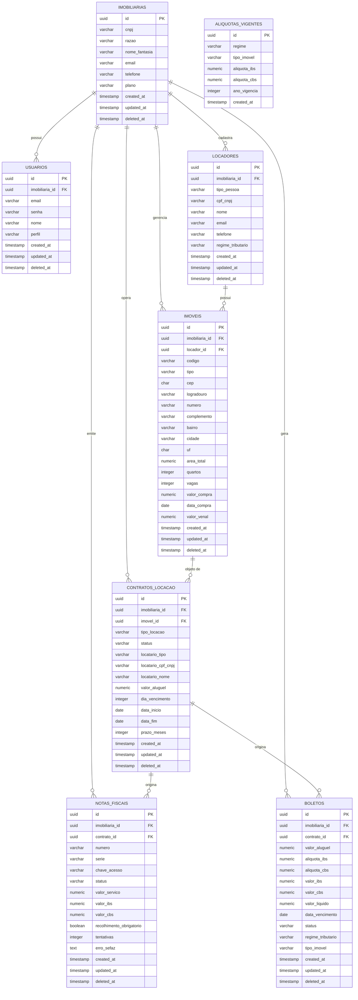

# Banco de Dados — ImobFiscal

**PI 2 · FATEC DSM 2026-2**

---

## DER — Diagrama Entidade-Relacionamento



---

## Arquivos

| Arquivo | Descrição |
|---|---|
| `schema.sql` | DDL — criação das 6 tabelas base |
| `V2__motor_fiscal.sql` | Migração V2 — adiciona `aliquotas_vigentes`, `boletos`, `regime_tributario` (locadores) e `valor_venal` (imoveis) |
| `seed.sql` | Dados fictícios para demonstração |

## Como executar

```bash
# 1. Criar o banco
psql -U postgres -c "CREATE DATABASE imobfiscal;"

# 2. Criar as tabelas base (schema.sql requer a extensão pgcrypto)
psql -U postgres -d imobfiscal -f database/schema.sql

# 3. Aplicar migração V2 (Motor Tributário + boletos)
psql -U postgres -d imobfiscal -f database/V2__motor_fiscal.sql

# 4. Inserir dados de exemplo
psql -U postgres -d imobfiscal -f database/seed.sql
```

## Observações

- `deleted_at`: todas as tabelas de negócio utilizam exclusão lógica. Registros com este campo preenchido são ignorados nas listagens (`WHERE deleted_at IS NULL`).
- `aliquota_ibs` / `aliquota_cbs` em `boletos` e `notas_fiscais`: valores decimais — ex: `0.0145` = 1,45%. Alíquotas ilustrativas conforme LC 214/2025.
- Chaves primárias: `UUID` gerado por `gen_random_uuid()` (requer extensão `pgcrypto`).
- Chaves estrangeiras: declaradas com `REFERENCES` para garantir integridade referencial.
- `aliquotas_vigentes`: não usa soft delete — é uma tabela de configuração, nunca apagada logicamente.
