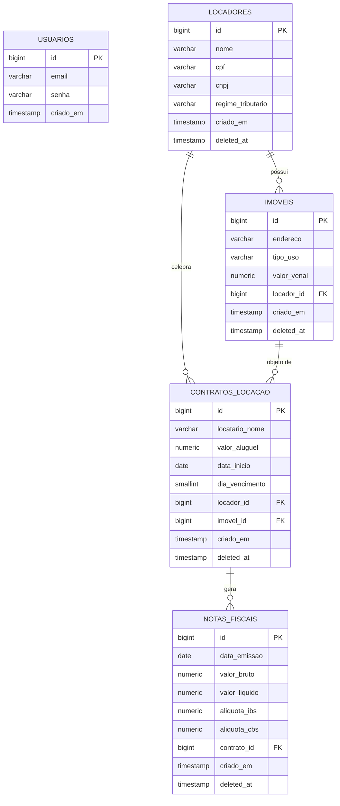

# Banco de Dados — ImobFiscal

**PI 2 · FATEC DSM 2026-2**

---

## DER — Diagrama Entidade-Relacionamento



---

## Arquivos

| Arquivo | Descrição |
|---|---|
| `schema.sql` | DDL — criação de todas as tabelas |
| `seed.sql` | Dados fictícios para demonstração |

## Como executar

```bash
# 1. Criar o banco
psql -U postgres -c "CREATE DATABASE imobfiscal;"

# 2. Criar as tabelas
psql -U postgres -d imobfiscal -f database/schema.sql

# 3. Inserir dados de exemplo
psql -U postgres -d imobfiscal -f database/seed.sql
```

## Observações

- `deleted_at`: todas as tabelas de negócio utilizam exclusão lógica. Registros com este campo preenchido são ignorados nas listagens (`WHERE deleted_at IS NULL`).
- `aliquota_ibs` e `aliquota_cbs`: valores decimais — ex: `0.0875` = 8,75%. Alíquotas ilustrativas conforme LC 214/2025.
- Chaves primárias: `BIGSERIAL` (auto-incremento).
- Chaves estrangeiras: declaradas com `REFERENCES` para garantir integridade referencial.
