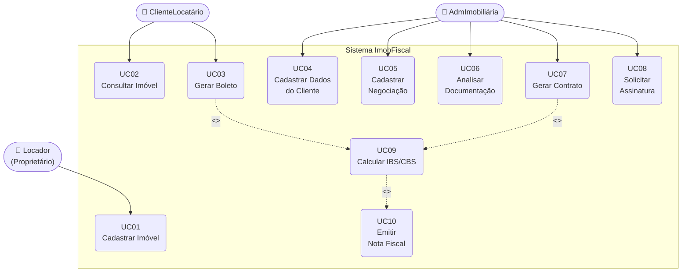

# Diagrama de Caso de Uso

**Sistema:** ImobFiscal — Gestão de Locação de Imóveis com Cálculo Tributário (IBS/CBS)
**Versão:** 1.0 — PI 2 / 2026

---

## Atores

| Ator | Tipo | Descrição |
| ---- | ---- | --------- |
| Locador | Principal | Proprietário do imóvel. Cadastra imóveis no sistema. |
| ClienteLocatário | Secundário | Inquilino. Consulta contrato e gera boleto. |
| AdmImobiliária | Secundário | Administrador da imobiliária. Gerencia contratos e negociações. |

---

## Casos de Uso

| Código | Nome | Ator(es) |
| ------ | ---- | -------- |
| UC01 | Cadastrar Imóvel | Locador |
| UC02 | Consultar Imóvel | ClienteLocatário |
| UC03 | Gerar Boleto | ClienteLocatário |
| UC04 | Cadastrar Dados do Cliente | AdmImobiliária |
| UC05 | Cadastrar Negociação | AdmImobiliária |
| UC06 | Analisar Documentação | AdmImobiliária |
| UC07 | Gerar Contrato | AdmImobiliária |
| UC08 | Solicitar Assinatura | AdmImobiliária |
| UC09 | Calcular IBS/CBS | Sistema (automático) |
| UC10 | Emitir Nota Fiscal | Sistema (automático) |

---

## Diagrama

---

## Descrição dos Casos de Uso

### UC01 — Cadastrar Imóvel

- **Ator:** Locador
- **Pré-condição:** Locador autenticado no sistema.
- **Fluxo principal:**
  1. Locador acessa a tela de imóveis.
  2. Preenche endereço, tipo de uso (Residencial/Comercial) e valor venal.
  3. Sistema salva o imóvel vinculado ao Locador.
- **Pós-condição:** Imóvel disponível para ser associado a um contrato.

---

### UC03 — Gerar Boleto

- **Ator:** ClienteLocatário
- **Pré-condição:** Contrato de locação ativo.
- **Fluxo principal:**
  1. Locatário acessa o portal e seleciona o contrato.
  2. Solicita a geração do boleto do mês.
  3. Sistema **inclui** UC09 — calcula IBS/CBS sobre o valor do aluguel.
  4. Sistema gera o boleto com o valor líquido e emite a Nota Fiscal (UC10).
  5. Locatário recebe o boleto para pagamento.
- **Pós-condição:** Boleto emitido; Nota Fiscal gerada com alíquotas IBS/CBS.

---

### UC07 — Gerar Contrato

- **Ator:** AdmImobiliária
- **Pré-condição:** Dados do cliente e negociação cadastrados (UC04, UC05, UC06).
- **Fluxo principal:**
  1. AdmImobiliária acessa a negociação aprovada.
  2. Sistema gera o contrato com os dados do locador, imóvel e locatário.
  3. Sistema **inclui** UC09 — define as alíquotas IBS/CBS conforme o regime tributário.
  4. Contrato é gerado para assinatura (UC08).
- **Pós-condição:** Contrato pronto para coleta de assinatura.

---

### UC09 — Calcular IBS/CBS *(caso de uso interno)*

- **Ator:** Sistema (acionado automaticamente)
- **Descrição:** Aplica as alíquotas IBS (estadual/municipal) e CBS (federal) conforme a
  Reforma Tributária (LC 214/2025). Usa a `CalculadoraReformaTributaria` para retornar
  o `DetalhamentoTributario` com os valores separados.
- **Regras aplicadas:**
  - IBS: 0,1% (2026, recolhimento dispensado)
  - CBS: 0,9% (2026, recolhimento dispensado)
  - Fator de redução: 30% para residencial, 40% para short stay
  - A partir de 2027: CBS plena (8,8%), recolhimento obrigatório
