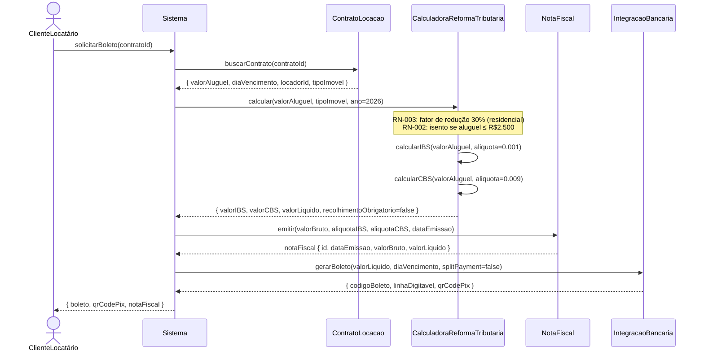
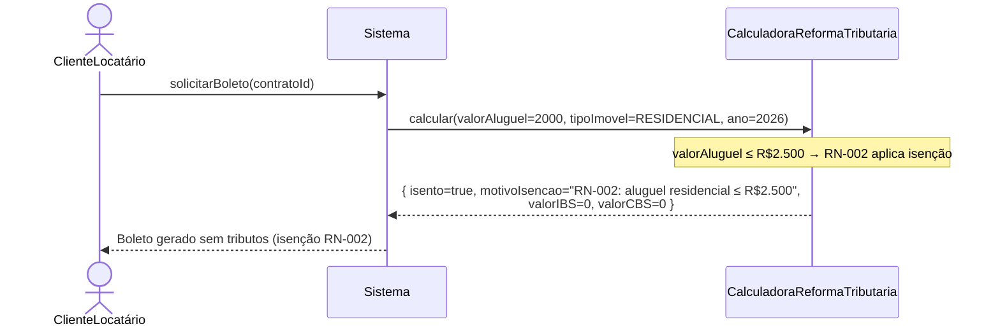

# Diagrama de Sequência

**Sistema:** ImobFiscal — Gestão de Locação de Imóveis com Cálculo Tributário (IBS/CBS)
**Versão:** 1.0 — PI 2 / 2026

---

## Fluxo representado

**"Geração de Boleto com Cálculo Tributário IBS/CBS"**

Este é o fluxo principal do sistema: o ClienteLocatário solicita o boleto do mês,
o sistema calcula os impostos devidos (IBS e CBS) conforme a Reforma Tributária,
emite a Nota Fiscal e entrega o boleto pronto para pagamento.

---

## Participantes

| Participante | Tipo | Papel |
| ------------ | ---- | ----- |
| ClienteLocatário | Ator | Solicita o boleto |
| Sistema | Controlador | Orquestra o fluxo |
| ContratoLocacao | Entidade | Armazena dados do aluguel |
| CalculadoraReformaTributaria | Serviço | Calcula IBS e CBS |
| NotaFiscal | Entidade | Registro fiscal da transação |
| IntegracaoBancaria | Serviço | Gera o boleto bancário |

---

## Diagrama

---

## Notas sobre o fluxo

### Por que `recolhimentoObrigatorio=false` em 2026?

Em 2026, o IBS e CBS estão na fase de transição. Os valores são **calculados e informados**
na Nota Fiscal, mas o recolhimento ao governo ainda não é obrigatório. A partir de 2027,
`recolhimentoObrigatorio` passa a `true` e o Split Payment entra em vigor.

### O que é Split Payment?

É um mecanismo da Reforma Tributária onde, no momento do pagamento do boleto/PIX, o banco
separa automaticamente a parte do imposto (IBS/CBS) e repassa ao governo. O locador recebe
apenas o valor líquido. Em 2026, isso ainda não está ativo (`splitPayment=false`).

### Fluxo de exceção — Aluguel isento (RN-002)

