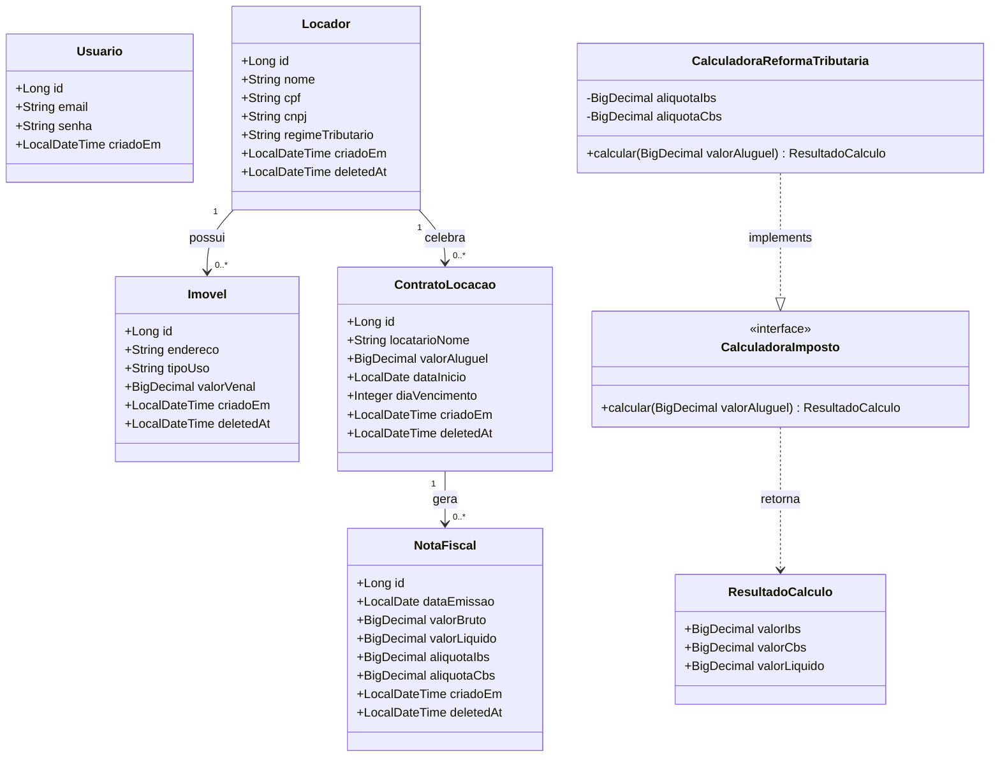

# Fase 2 — Diagrama de Classes

**Projeto:** ImobFiscal  
**PI:** 2º Semestre DSM — FATEC Indaiatuba  
**Data:** 2026-06-01

---

## Diagrama

---

## Descrição das Classes

### Entidades de domínio

| Classe | Responsabilidade |
|---|---|
| **Usuario** | Usuário autenticado no sistema (AdmImobiliaria). Armazena e-mail e senha com hash BCrypt |
| **Locador** | Proprietário do imóvel — pode ser Pessoa Física (CPF) ou Pessoa Jurídica (CNPJ). O campo `regimeTributario` define as alíquotas aplicáveis |
| **Imovel** | Bem imóvel vinculado a um Locador. O `tipoUso` distingue Residencial de Comercial |
| **ContratoLocacao** | Formaliza a relação entre Locador e Locatário. Contém o valor do aluguel que será base para o cálculo tributário |
| **NotaFiscal** | Registra os valores tributários (IBS e CBS) calculados sobre o aluguel de um Contrato |

### Classes de cálculo

| Classe | Responsabilidade |
|---|---|
| **CalculadoraImposto** | Interface que define o contrato de cálculo tributário — padrão Strategy |
| **CalculadoraReformaTributaria** | Implementa o cálculo de IBS e CBS conforme LC 214/2025 |
| **ResultadoCalculo** | Objeto com os valores calculados: IBS, CBS e valor líquido |

---

## Relacionamentos

| Relacionamento | Cardinalidade | Descrição |
|---|---|---|
| Locador → Imovel | 1 para N | Um Locador pode ter vários imóveis |
| Locador → ContratoLocacao | 1 para N | Um Locador pode ter vários contratos |
| ContratoLocacao → NotaFiscal | 1 para N | Um Contrato pode gerar várias notas fiscais |
| CalculadoraReformaTributaria → CalculadoraImposto | Implementação | Segue o padrão Strategy |

---

## Observações

- `deletedAt`: campo presente nas entidades de negócio para exclusão lógica (soft delete). Registros com este campo preenchido são tratados como excluídos.
- `regimeTributario`: valores possíveis — `PF`, `PJ`, `SIMPLES`.
- `tipoUso`: valores possíveis — `RESIDENCIAL`, `COMERCIAL`.
- O cálculo tributário não é persistido diretamente — é gerado pelo `CalculadoraReformaTributaria` e armazenado na `NotaFiscal`.
