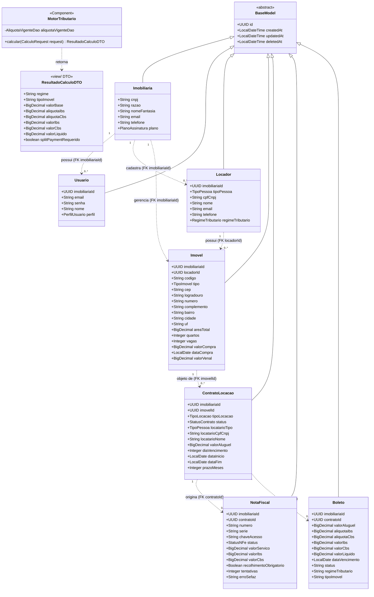

# Fase 2 — Diagrama de Classes

**Projeto:** ImobFiscal  
**PI:** 2º Semestre DSM — FATEC Indaiatuba  
**Data:** 2026-06-01

---

## Diagrama

> **Relacionamentos por FK UUID (não por navegação de objetos).** No padrão MVC
> adotado, os POJOs do `model/` **não** referenciam outros objetos: cada relação é
> uma **chave estrangeira `UUID`** (ex.: `Imovel.imobiliariaId`, `Imovel.locadorId`,
> `ContratoLocacao.imovelId`, `NotaFiscal.contratoId`). As associações desenhadas
> acima (linhas tracejadas) representam essas FKs; a ligação é **resolvida via
> SQL/JOIN nos DAOs** (`model/dao`), não por navegação como `contrato.getImovel()`.
> Ex.: o `GeradorBoleto` segue a cadeia `contrato → imovelId → locadorId`
> consultando um DAO por vez.
>
> **Nota sobre o Motor Tributário.** No código real, o cálculo está em
> `model/MotorTributario` (um `@Component`, não uma interface Strategy) e o
> resultado é o record `ResultadoCalculoDTO` em `view/motor/`. A entrada é o DTO
> `CalculoRequest` (`valorBase`, `regime`, `tipoImovel`). As alíquotas são
> buscadas no banco por `AliquotaVigenteDao` — nunca hardcoded (RN-003). O
> diagrama anterior usava os nomes conceituais `CalculadoraImposto` /
> `CalculadoraReformaTributaria` / `ResultadoCalculo`; eles foram substituídos
> pelos nomes reais.

---

## Descrição das Classes

### Models de domínio (pacote `model/`)

> São **POJOs simples, sem anotações JPA** (não são entidades Hibernate). O
> mapeamento tabela↔objeto é feito manualmente nos DAOs (`model/dao`) via
> `RowMapper`, e o acesso a dados usa **SQL puro** com `JdbcTemplate` — não há
> repositories JPA.

| Classe | Responsabilidade |
|---|---|
| **BaseModel** | Superclasse abstrata (POJO, **sem JPA**). Fornece `id` (UUID), `createdAt`, `updatedAt` e `deletedAt` aos demais models. O DAO preenche esses campos no SQL |
| **Imobiliaria** | Tenant raiz do sistema. Todas as demais entidades pertencem a uma imobiliária |
| **Usuario** | Usuário do sistema vinculado a uma imobiliária (FK `imobiliariaId`). Armazena e-mail, senha (hash BCrypt), nome e perfil de acesso |
| **Locador** | Proprietário do imóvel — Pessoa Física ou Jurídica. O campo `regimeTributario` define as alíquotas IBS/CBS aplicáveis |
| **Imovel** | Bem imóvel vinculado a uma Imobiliária (FK `imobiliariaId`) e, opcionalmente, a um Locador (FK `locadorId`). O campo `tipo` distingue Residencial, Comercial, Rural e Misto |
| **ContratoLocacao** | Formaliza a relação entre o imóvel (FK `imovelId`) e o Locatário. Contém o valor do aluguel que serve de base para o cálculo tributário |
| **NotaFiscal** | Registra os valores tributários (IBS e CBS) calculados sobre o aluguel de um Contrato (FK `contratoId`). Inclui status de envio à SEFAZ (**simulado** no PI) |
| **Boleto** | Boleto de aluguel com detalhamento fiscal (IBS/CBS/Split Payment), originado de um Contrato (FK `contratoId`). Congela o snapshot fiscal (alíquotas, regime, tipo) no momento da geração. **Simulado** no PI |

### Regra de negócio e DTO de cálculo

| Classe | Responsabilidade |
|---|---|
| **MotorTributario** | `@Component` no `model/` (não é interface Strategy). Calcula IBS/CBS conforme LC 214/2025, buscando as alíquotas em `AliquotaVigenteDao` — nunca hardcoded (RN-003) |
| **ResultadoCalculoDTO** | `record` da camada View (`view/motor/`) com o resultado do cálculo: regime, tipo, valor base, alíquotas, valores IBS/CBS, valor líquido e flag de Split Payment |

---

## Relacionamentos

> As relações abaixo são materializadas como **chaves estrangeiras `UUID`** nos
> POJOs (não como objetos aninhados) e resolvidas via SQL/JOIN nos DAOs.

| Relacionamento | FK no model | Cardinalidade | Descrição |
|---|---|---|---|
| Imobiliaria → Usuario | `Usuario.imobiliariaId` | 1 para N | Uma Imobiliária pode ter vários usuários |
| Imobiliaria → Locador | `Locador.imobiliariaId` | 1 para N | Uma Imobiliária cadastra vários locadores |
| Imobiliaria → Imovel | `Imovel.imobiliariaId` | 1 para N | Uma Imobiliária gerencia vários imóveis |
| Locador → Imovel | `Imovel.locadorId` | 1 para N | Um Locador pode ter vários imóveis |
| Imovel → ContratoLocacao | `ContratoLocacao.imovelId` | 1 para N | Um Imóvel pode ter vários contratos (histórico) |
| ContratoLocacao → NotaFiscal | `NotaFiscal.contratoId` | 1 para N | Um Contrato pode originar várias notas fiscais |
| ContratoLocacao → Boleto | `Boleto.contratoId` | 1 para N | Um Contrato pode originar vários boletos |

---

## Observações

- **Persistência sem ORM:** os models são POJOs simples; o acesso a dados é feito por **DAOs** (`model/dao`) com **SQL puro** via `JdbcTemplate`, não por repositories JPA. O schema é criado por scripts SQL em `database/`.
- **Relações por FK UUID:** os POJOs guardam as chaves estrangeiras como `UUID` (ex.: `imobiliariaId`, `locadorId`, `imovelId`, `contratoId`), não como objetos aninhados. A navegação entre entidades é feita por consulta SQL/JOIN no DAO.
- `deletedAt`: campo presente nos models de negócio para exclusão lógica (soft delete). Registros com este campo preenchido são tratados como excluídos; o soft delete é um `UPDATE deleted_at = ?`, nunca `DELETE` físico.
- `tipo` (Imovel): valores possíveis — `RESIDENCIAL`, `COMERCIAL`, `RURAL`, `MISTO` (enum `TipoImovel`).
- O cálculo tributário não é persistido diretamente — é gerado pelo `MotorTributario` (model, `@Component`), devolvido como `ResultadoCalculoDTO` e gravado na `NotaFiscal` ou no `Boleto`.
