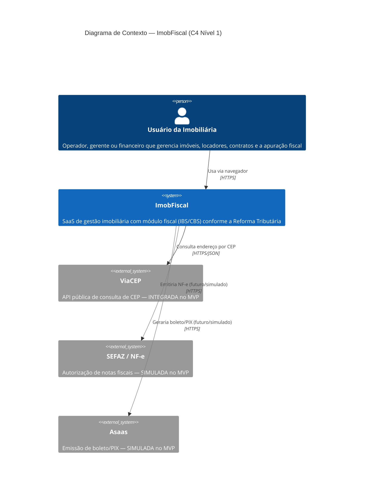
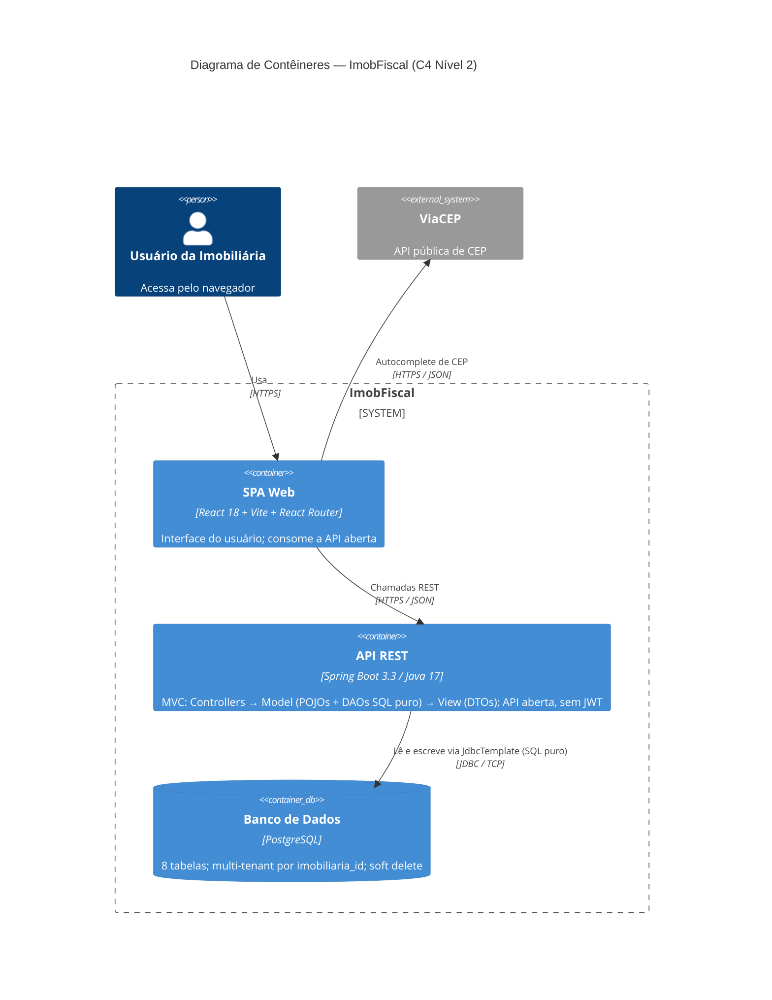
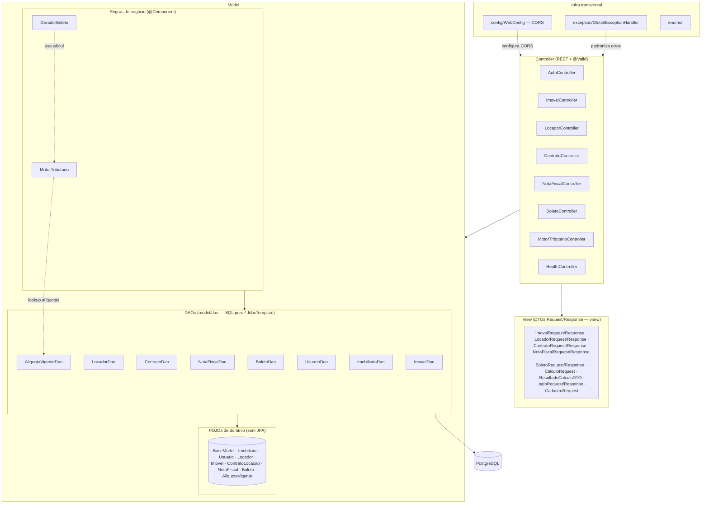
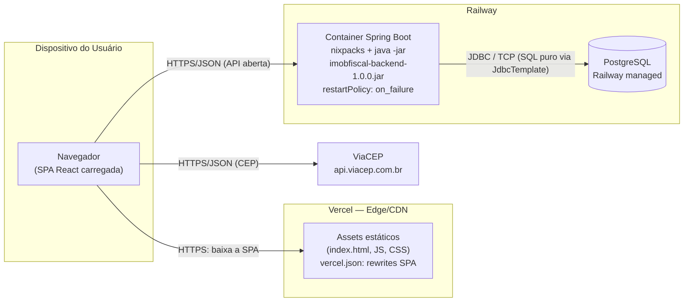

# Documento de Arquitetura de Software — ImobFiscal

> Projeto Integrador 2 · FATEC · 2026
> Versão verificada contra o código em 2026-06-02.

---

## 1. Objetivo e escopo

Este documento descreve a arquitetura de software do **ImobFiscal**, um SaaS de
gestão imobiliária com módulo fiscal alinhado à Reforma Tributária (LC 214/2025).
Ele serve de referência única para a banca avaliadora e para a equipe de
desenvolvimento, registrando: o estilo arquitetural adotado, a decomposição em
camadas, as visões C4 (contexto, contêineres, componentes e implantação), as
decisões arquiteturais que moldaram o sistema, os requisitos não-funcionais e os
riscos/limitações conhecidos.

**Escopo do documento.** Cobre o MVP acadêmico efetivamente implementado e
implantado: a SPA React, a API Spring Boot e o banco PostgreSQL. Integrações
externas previstas no domínio (SEFAZ/NF-e e Asaas/boleto) estão descritas como
**simuladas** — não há integração real no MVP. Apenas o **ViaCEP** está de fato
integrado (autocomplete de CEP no frontend).

**Fora de escopo.** Detalhamento de regras fiscais (ver `docs/knowledge-base-fiscal.md`),
modelo de domínio detalhado (ver `docs/domain-model.md`) e o DER formal
(ver `docs/09-der.md`).

---

## 2. Visão geral e estilo arquitetural

O ImobFiscal segue o estilo **cliente-servidor em 3 camadas físicas**, com o
backend internamente organizado segundo o padrão **MVC clássico**
(Model · View · Controller). O código vive em um **monorepo** simples, com três
diretórios de topo:

```
imobfiscal/
├── frontend/    → SPA React 18 + Vite (deploy na Vercel)
├── backend/     → API REST Spring Boot 3.3 + Java 17 (deploy no Railway)
└── database/    → schema.sql + V2__motor_fiscal.sql (PostgreSQL no Railway)
```

### Camadas físicas (3 camadas)

| Camada | Tecnologia | Hospedagem | Responsabilidade |
| --- | --- | --- | --- |
| Apresentação | React 18 + Vite + React Router + Axios | Vercel (CDN estático) | UI, formulários, roteamento client-side |
| Aplicação | Spring Boot 3.3 + Java 17 | Railway (nixpacks, `java -jar`) | API REST, regras de negócio |
| Dados | PostgreSQL | Railway | Persistência relacional, integridade |

A comunicação entre apresentação e aplicação é **HTTPS/JSON**. A API é **aberta**:
não há autenticação por JWT nem Spring Security. O login (`/api/auth/login`)
apenas confere e-mail e senha (hash **BCrypt**) e devolve um marcador de sessão
que a API **não valida** em nenhuma rota — ver ADR-02 e o risco R1 na seção 9.
Em desenvolvimento, o Vite faz **proxy** de `/api` para `http://localhost:8080`;
em produção o frontend usa a variável `VITE_API_URL`.

### Organização interna do backend (MVC clássico)

```
Controller (REST, @Valid, recebe/devolve DTOs)
    ↓
Model
   ├── POJOs de domínio (sem anotações JPA)
   ├── Regras de negócio (MotorTributario, GeradorBoleto — @Component)
   └── DAOs (model/dao) — SQL puro via JdbcTemplate ↔ PostgreSQL
    ↕
View (DTOs Request/Response em view/)
```

A organização é a tríade **MVC** sem camada de *service*: o Controller coordena e
fala direto com o Model. O Model concentra os POJOs de domínio, as regras de
negócio (como `@Component`) e os DAOs de acesso a dados. A View são os DTOs de
entrada e saída, agrupados por módulo em `view/`. Em volta, três pacotes de
infraestrutura transversal:

- **`config/`** — `WebConfig` (configuração de CORS via `WebMvcConfigurer`).
- **`exception/`** — `GlobalExceptionHandler` (`@RestControllerAdvice`), que
  padroniza os erros em JSON.
- **`enums/`** — enums de domínio (`TipoImovel`, `RegimeTributario`, `StatusNFe`...).

Padrões e decisões presentes:

- **DAO (Data Access Object)** — cada model de domínio tem um DAO em `model/dao`
  com SQL puro (`SELECT`/`INSERT`/`UPDATE`) executado por `JdbcTemplate` e um
  `RowMapper` manual. Não há ORM nem repositórios Spring Data JPA.
- **DTO** — contratos de entrada/saída (camada View) desacoplados dos POJOs de
  domínio.
- **Regra de negócio no Model** — `MotorTributario` e `GeradorBoleto` são
  `@Component` injetados nos controllers, sem uma camada de service intermediária.
- **Strategy / lookup tributário** — no Motor Tributário, as alíquotas **nunca**
  são hardcoded; são buscadas em `aliquotas_vigentes` pela chave
  `(regime, tipo_imovel, ano_vigencia)`. Trocar de ano ou regime é trocar a
  linha consultada, não o código.

---

## 3. Diagrama de contexto (C4 — Nível 1)

Mostra o sistema como uma caixa única e seus atores/integrações externas.



> As ligações em cinza (SEFAZ e Asaas) representam integrações **previstas no
> domínio mas simuladas** no MVP. O ViaCEP é a única integração externa real.

---

## 4. Diagrama de contêineres (C4 — Nível 2)

Abre o sistema nos seus contêineres executáveis e mostra os protocolos.



> Observação: a consulta ao ViaCEP parte do **frontend** (autocomplete no
> formulário de imóvel), não da API.

---

## 5. Diagrama de componentes (camadas e módulos do backend)

Detalha a organização interna da API: o fluxo de camadas e os módulos de negócio.



**Módulos de negócio:** Auth, Imovel, Locador, Contrato, NotaFiscal, Boleto e
MotorTributario. A API é **aberta** — não há rotas protegidas por autenticação;
`/api/auth/**` (login/cadastro) e `/api/health` são endpoints comuns. O
`MotorTributario` (model, `@Component`) é o coração fiscal: resolve a alíquota
por lookup em `AliquotaVigenteDao` e é reutilizado pelo `GeradorBoleto`
(também no model) para o Split Payment.

---

## 6. Diagrama de implantação (deployment)

Mostra onde cada artefato roda em produção e como se conectam.



> Topologia de **instância única**: um container de API e um banco, sem réplicas
> nem balanceador. Adequado ao MVP acadêmico; ver riscos na seção 9.

---

## 7. Decisões arquiteturais (mini-ADRs)

### ADR-01 — Backend em Spring Boot (em vez do NestJS inicial)

- **Contexto.** O scaffold inicial (documentado no CLAUDE.md) previa NestJS em
  monorepo Turborepo. A equipe é de estudantes FATEC e precisava de uma stack
  com forte tipagem, validação madura e alinhada ao currículo Java da faculdade.
- **Decisão.** Adotar Spring Boot 3.3 + Java 17, usando `spring-boot-starter-web`
  (REST), `spring-boot-starter-validation` (`@Valid`) e
  `spring-boot-starter-jdbc` (acesso a dados). O NestJS fica como referência
  legada, não usado em produção.
- **Consequências.** (+) Ecossistema maduro, validação pronta; alinhado ao
  currículo Java da faculdade. (−) Mais verboso que TypeScript; build mais pesado
  (Maven). Lombok mitiga o boilerplate. Sem ORM e sem framework de segurança —
  ver ADR-02 e ADR-09.

### ADR-02 — API aberta (sem autenticação / sem JWT)

- **Contexto.** Trata-se de um projeto **acadêmico** (PI 2 FATEC). A API é
  consumida exclusivamente pela própria SPA do sistema; não há integradores
  externos nem múltiplos clientes. Uma camada de autenticação (JWT + Spring
  Security) adicionava complexidade (filtro, segredo HMAC, ciclo de token,
  configuração de segurança) sem trazer valor para o escopo da entrega.
- **Decisão.** A API é **aberta** — nenhuma rota exige autenticação. Removidos do
  `pom.xml`: `spring-boot-starter-security`, `jjwt` e `spring-security-test`; a
  classe `SecurityConfig` foi deletada. O login (`/api/auth/login`) confere
  e-mail + senha com **BCrypt** (via a biblioteca leve `spring-security-crypto`,
  mantida) e devolve um "token" que é apenas um **marcador de sessão** para o
  frontend — a API não o valida em rota alguma. O CORS, que antes vivia no
  `SecurityConfig`, passou a ser configurado em `config/WebConfig`
  (`WebMvcConfigurer`).
- **Consequências.** (+) Simplicidade; menos dependências; sem ciclo de token a
  gerenciar; CORS isolado em uma classe MVC dedicada. (−) **A API fica aberta**:
  qualquer cliente que alcance a URL pode ler e escrever dados. Aceitável no MVP
  acadêmico, mas **deve ser fechada antes de produção** (ver risco R1 na seção 9).

### ADR-03 — Multi-tenancy shared-schema por coluna

- **Contexto.** Várias imobiliárias compartilham a aplicação. Opções: banco por
  tenant, schema por tenant, ou schema compartilhado com coluna discriminadora.
- **Decisão.** **Shared-schema** com coluna `imobiliaria_id` (NOT NULL) em todas
  as 8 tabelas de negócio. Não se usa Row Level Security do PostgreSQL.
- **Consequências.** (+) Operação simples, um único banco, baixo custo —
  adequado ao porte do MVP. (−) O isolamento depende inteiramente do filtro
  `imobiliaria_id` na aplicação; sem RLS não há segunda linha de defesa no banco.
  Ver limitação na seção 9.

### ADR-04 — Alíquotas em tabela parametrizada (Strategy / lookup)

- **Contexto.** As alíquotas IBS/CBS mudam a cada ano da transição da Reforma
  Tributária (2026–2033) e variam por regime e tipo de imóvel.
- **Decisão.** Manter as alíquotas na tabela `aliquotas_vigentes`, consultadas
  pela chave única `(regime, tipo_imovel, ano_vigencia)`. **Nunca** hardcodar
  alíquota no código Java.
- **Consequências.** (+) Mudança de ano fiscal vira um `INSERT`, sem deploy de
  código; cálculo auditável; histórico anual preservado. (−) Exige seed correto
  e governança de quem altera a tabela; alíquota ausente para um ano/regime
  precisa de tratamento de erro explícito.

### ADR-05 — Soft delete por guarda fiscal

- **Contexto.** Dados fiscais (contratos, notas, boletos) têm prazo legal de
  guarda de 5 anos. Exclusão física perderia histórico exigível.
- **Decisão.** Soft delete via coluna `deleted_at` (nullable) em todas as tabelas
  de negócio, somado a `created_at`/`updated_at` herdados de `BaseModel`. Como o
  acesso é por SQL puro, o soft delete é um `UPDATE deleted_at = ?` e a leitura
  filtra `deleted_at IS NULL` explicitamente em cada DAO; **nunca** há `DELETE`
  físico.
- **Consequências.** (+) Histórico preservado, conformidade fiscal, possibilidade
  de auditoria. (−) Toda query precisa filtrar `deleted_at IS NULL`; crescimento
  da tabela ao longo do tempo; risco de "vazar" registro deletado se o filtro
  for esquecido no SQL do DAO.

### ADR-06 — PKs UUID

- **Contexto.** Sistema multi-tenant onde IDs sequenciais expõem volume e ordem
  de cadastro entre tenants e dificultam merge de dados.
- **Decisão.** Chaves primárias UUID. Como não há ORM, o UUID é gerado em **Java**
  pelo próprio DAO no momento do `INSERT` (`UUID.randomUUID()`), e não por
  `gen_random_uuid()` no banco.
- **Consequências.** (+) IDs não-adivinháveis, gerados na aplicação, sem colisão
  entre ambientes. (−) Índices maiores e levemente mais lentos que `BIGSERIAL`;
  irrelevante na escala do MVP (10–200 imóveis por carteira).

### ADR-07 — Monorepo

- **Contexto.** Frontend, backend e scripts de banco evoluem juntos; equipe
  pequena de estudantes.
- **Decisão.** Um único repositório com `frontend/`, `backend/` e `database/`.
- **Consequências.** (+) Uma mudança transversal num único PR; setup e clone
  únicos; visão completa do sistema. (−) Sem isolamento de versionamento por
  serviço; CI precisa distinguir o que mudou (mitigável, fora do escopo do MVP).

### ADR-08 — Deploy Vercel (frontend) + Railway (backend e banco)

- **Contexto.** Necessidade de hospedagem gratuita/barata, simples e com HTTPS
  automático para a entrega acadêmica.
- **Decisão.** SPA estática na Vercel (com `rewrites` para roteamento SPA);
  API Spring Boot e PostgreSQL no Railway (build nixpacks, `java -jar`).
- **Consequências.** (+) Deploy simples, HTTPS e CDN prontos, custo baixo,
  separação clara de responsabilidades. (−) Dois provedores para gerenciar;
  latência adicional entre Vercel e Railway; instância única sem réplica.

### ADR-09 — Persistência com SQL puro (JdbcTemplate) em vez de JPA/Hibernate

- **Contexto.** A disciplina do PI exige que os alunos **escrevam o SQL na mão**
  (SELECT/INSERT/UPDATE), demonstrando domínio de banco relacional. Um ORM
  (JPA/Hibernate) esconderia exatamente o que a avaliação quer ver.
- **Decisão.** Remover JPA/Hibernate do `pom.xml` e adotar
  `spring-boot-starter-jdbc`. Cada model de domínio tem um DAO em `model/dao`
  que executa SQL puro via `JdbcTemplate`, com `RowMapper` manual mapeando
  `ResultSet → POJO`. Os POJOs **não têm anotações JPA**; guardam as FKs como
  `UUID` direto (ex.: `Imovel.imobiliariaId`, `Imovel.locadorId`), sem objetos
  aninhados. O schema é criado por **scripts SQL** em `database/` (não há
  `ddl-auto` nem geração de schema por ORM). Multi-tenancy e soft delete são
  cláusulas `WHERE`/`UPDATE` escritas no SQL de cada DAO.
- **Consequências.** (+) Controle e visibilidade totais do SQL gerado; alinhado
  à exigência da disciplina; sem "mágica" de ORM; fácil de auditar e ensinar.
  (−) Mais código manual (cada CRUD e cada `RowMapper` escrito à mão); sem
  *lazy loading* nem navegação de objetos — relações são resolvidas seguindo a
  cadeia de UUIDs em DAOs distintos (ver `GeradorBoleto`); risco de divergência
  entre POJO e schema, mitigado por testes de DAO.

### ADR-10 — MVC clássico sem camada de service

- **Contexto.** O padrão Controller → Service → Repository → Entity adiciona uma
  camada de orquestração (service) que, no porte deste MVP, repassaria chamadas
  quase 1:1. Para um projeto didático, a tríade **MVC** é mais simples de ensinar
  e de mapear ao currículo.
- **Decisão.** Organizar o backend em **MVC clássico**: `controller/` (REST),
  `model/` (POJOs de domínio + regras de negócio como `@Component` +
  `model/dao` com SQL puro) e `view/` (DTOs Request/Response). **Não há camada de
  service**: o Controller fala direto com o Model. A lógica de negócio fiscal
  vive no model (`MotorTributario`, `GeradorBoleto`).
- **Consequências.** (+) Menos camadas e menos indireção; fácil de explicar na
  banca; cada responsabilidade em um pacote claro (M/V/C + infra em
  `config/`, `exception/`, `enums/`). (−) Regra de negócio mais complexa
  tenderia a inchar os controllers ou os `@Component` do model; reintroduzir uma
  camada de service seria o caminho natural de evolução pós-MVP.

---

## 8. Requisitos não-funcionais e como a arquitetura os atende

| RNF | Como a arquitetura atende |
| --- | --- |
| **Segurança** | Senhas com BCrypt; CORS restrito às origens conhecidas (`config/WebConfig`); validação `@Valid` nos DTOs; UUID como PK reduz enumeração; SQL parametrizado no `JdbcTemplate` evita injeção. **Limitação consciente:** a API é aberta (sem autenticação/JWT) — ver ADR-02 e risco R1. |
| **Manutenibilidade** | Organização MVC (controller/model/view) + infra em config/exception/enums; padrões DAO/DTO/Strategy; SQL explícito e auditável nos DAOs; código didático em PT-BR no domínio. Trocar alíquota não exige tocar em código. |
| **Portabilidade fiscal ano-a-ano** | Tabela `aliquotas_vigentes` com `ano_vigencia` permite conviver com múltiplos anos; mudança de transição (2026→2027→...) é dado, não código. Flags `recolhimento_obrigatorio` por nota refletem a fase da Reforma. |
| **Multi-tenancy** | Coluna `imobiliaria_id` (NOT NULL) em todas as tabelas de negócio; filtragem na camada de aplicação. |
| **Integridade dos dados** | Constraints no banco: `CHECK` em enums, `UNIQUE` (CNPJ, e-mail, chave de acesso, chave de alíquota), FKs declaradas, `NOT NULL` em campos obrigatórios. |
| **Conformidade / auditoria** | Soft delete (`deleted_at`) garante guarda fiscal de 5 anos; `created_at`/`updated_at` rastreiam mutações; boletos congelam alíquota e contexto fiscal no momento da geração (imutabilidade). |
| **Escalabilidade** | Backend stateless permite escalar horizontalmente; no MVP roda em instância única (limitação consciente). |

---

## 9. Riscos arquiteturais e limitações conhecidas

| # | Risco / Limitação | Impacto | Mitigação / Caminho futuro |
| --- | --- | --- | --- |
| R1 | **API aberta sem autenticação.** Não há JWT nem Spring Security; nenhuma rota exige login. Qualquer cliente que alcance a URL pode ler e escrever dados de qualquer imobiliária (o `imobiliariaId` vem da requisição, não de um token confiável). | Alto (limitação consciente) | Aceitável no MVP **acadêmico**, em que a API só conversa com o próprio frontend. **Fechar antes de produção:** reintroduzir autenticação (JWT/sessão) e derivar o tenant de um token confiável. Ver ADR-02. |
| R2 | **Ausência de RLS.** Sem Row Level Security no PostgreSQL, o banco não oferece segunda linha de defesa; o isolamento depende 100% do filtro na aplicação. | Médio-alto | Avaliar RLS por `imobiliaria_id` como defesa em profundidade em evolução pós-MVP. |
| R3 | **NF-e simulada.** A integração SEFAZ não existe; a entidade `notas_fiscais` modela o domínio (status, retry, chave de acesso) mas nenhuma nota é realmente autorizada. | Médio (escopo) | Integração assíncrona com fila e backoff (já modelada nos campos `tentativas`/`erro_sefaz`) em fase futura. |
| R4 | **Boleto simulado.** O fluxo `boletos` calcula valores e Split Payment, mas não há gateway (Asaas) real; status é simplificado (GERADO/PAGO/VENCIDO/CANCELADO). | Baixo-médio (escopo) | Integrar Asaas sandbox e webhooks de pagamento em evolução. |
| R5 | **Instância única sem réplica.** Um container de API e um banco no Railway; sem balanceador, sem alta disponibilidade, sem réplica de leitura. | Médio (disponibilidade) | Aceitável no MVP. Escalar para múltiplas réplicas (backend é stateless) e backup/HA do banco em produção real. |
| R6 | **`IMOBILIARIA_ID` fixo no frontend.** O `api.js` usa um UUID placeholder (`1111...`) em vez de derivar o tenant do usuário logado. Sem autenticação, não há fonte confiável de tenant. | Médio (correção do MVP) | Derivar o `imobiliariaId` de uma sessão/token confiável após reintroduzir a autenticação (ver R1). |

---

## 10. Referências

- `docs/09-der.md` — Diagrama Entidade-Relacionamento formal.
- `docs/domain-model.md` — Modelo de domínio e máquinas de estado.
- `docs/knowledge-base-fiscal.md` — Regras de negócio fiscais (RN-XXX).
- `docs/reforma-tributaria-calculos.md` — Algoritmos de cálculo IBS/CBS.
- Código verificado: `database/schema.sql`, `database/V2__motor_fiscal.sql`
  (schema criado via scripts SQL, sem ORM), `backend/pom.xml`
  (`spring-boot-starter-jdbc`, sem JPA/Security), `backend/railway.toml`,
  `frontend/package.json`, `frontend/vercel.json`,
  `frontend/src/services/api.js`. Pacotes do backend: `controller/`, `model/`,
  `model/dao/`, `view/`, `config/`, `exception/`, `enums/`.
- Modelo C4 — https://c4model.com
- LC 214/2025 — Reforma Tributária (IBS/CBS).

---

_Última atualização: 2026-06-02 · Verificado contra o código em produção._
