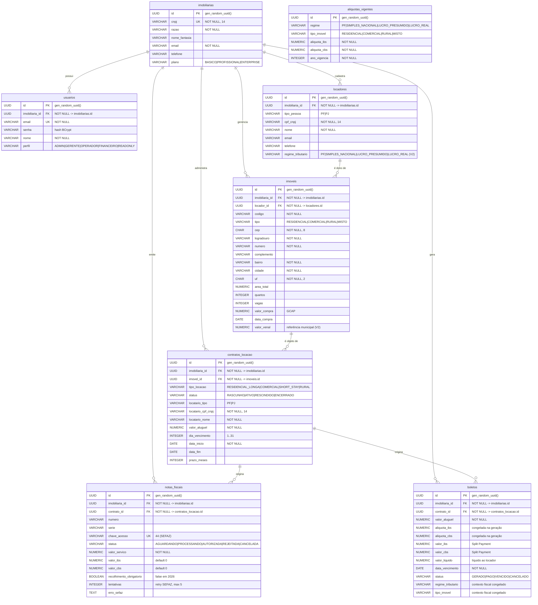

# Diagrama Entidade-Relacionamento (DER) — ImobFiscal

> Projeto Integrador 2 · FATEC · 2026
> Fiel a `database/schema.sql` + `database/V2__motor_fiscal.sql`.
> Verificado contra o código em 2026-06-02.

---

## 1. Introdução

Um **Diagrama Entidade-Relacionamento (DER)** é a representação gráfica da
estrutura lógica de um banco de dados relacional. Ele mostra as **entidades**
(tabelas), seus **atributos** (colunas, com tipo e papel — chave primária ou
estrangeira) e os **relacionamentos** entre elas, com a respectiva
**cardinalidade** (quantos registros de uma entidade se associam a quantos de
outra).

O DER abaixo reflete fielmente as **8 tabelas** do ImobFiscal, considerando o
schema base e a migração `V2` (que adiciona `regime_tributario` em `locadores`,
`valor_venal` em `imoveis`, e cria as tabelas `aliquotas_vigentes` e `boletos`).
Para não poluir o diagrama, as colunas de auditoria comuns a todas as tabelas
(`created_at`, `updated_at`, `deleted_at`) são citadas na legenda, e não repetidas
em cada entidade.

---

## 2. Diagrama (Mermaid `erDiagram`)

> **Nota sobre `aliquotas_vigentes`:** é uma **tabela de parâmetro** (lookup),
> sem chave estrangeira para nenhuma outra tabela. Ela é consultada pelo
> `MotorTributarioService` pela chave única `(regime, tipo_imovel, ano_vigencia)`
> para resolver as alíquotas no momento do cálculo. Por isso aparece **isolada**
> no diagrama, sem relacionamento desenhado.

---

## 3. Legenda da notação

| Símbolo / marca | Significado |
| --- | --- |
| **PK** | *Primary Key* — chave primária da tabela. Aqui sempre `UUID` gerado por `gen_random_uuid()`. |
| **FK** | *Foreign Key* — chave estrangeira; referencia a PK de outra tabela. |
| **UK** | *Unique Key* — coluna com restrição `UNIQUE` (não é chave primária, mas não admite duplicatas). |
| `\|\|--o{` | Cardinalidade **um-para-muitos (1:N)**: o lado `\|\|` é "exatamente um" (o pai) e o lado `o{` é "zero ou muitos" (os filhos). |

**Notação de cardinalidade (crow's foot) usada:**
- `||` → exatamente um (obrigatório).
- `o{` → zero ou muitos.

**Colunas de auditoria (presentes em todas as tabelas, omitidas no diagrama):**
- `created_at TIMESTAMP NOT NULL DEFAULT NOW()`
- `updated_at TIMESTAMP NOT NULL DEFAULT NOW()` (exceto `aliquotas_vigentes`, que só tem `created_at`)
- `deleted_at TIMESTAMP` (soft delete — guarda fiscal de 5 anos; ausente em `aliquotas_vigentes`)

**Observação importante sobre o relacionamento locador↔contrato:**
`contratos_locacao` **não** referencia `locadores` diretamente. O vínculo é
**indireto, via imóvel**: `contratos_locacao.imovel_id → imoveis.id → imoveis.locador_id → locadores.id`.
Ou seja, o locador (proprietário) de um contrato é descoberto pelo imóvel objeto
do contrato. Já os dados do **locatário** (inquilino) ficam *desnormalizados*
dentro de `contratos_locacao` (`locatario_tipo`, `locatario_cpf_cnpj`,
`locatario_nome`) para preservar o histórico fiscal no momento do contrato.

---

## 4. Tabela resumo dos relacionamentos

| # | Tabela pai (1) | Tabela filha (N) | Cardinalidade | Chave estrangeira | Significado |
| --- | --- | --- | --- | --- | --- |
| 1 | `imobiliarias` | `usuarios` | 1:N | `usuarios.imobiliaria_id` | Uma imobiliária possui muitos usuários. |
| 2 | `imobiliarias` | `locadores` | 1:N | `locadores.imobiliaria_id` | Uma imobiliária cadastra muitos locadores. |
| 3 | `imobiliarias` | `imoveis` | 1:N | `imoveis.imobiliaria_id` | Uma imobiliária gerencia muitos imóveis. |
| 4 | `imobiliarias` | `contratos_locacao` | 1:N | `contratos_locacao.imobiliaria_id` | Uma imobiliária administra muitos contratos. |
| 5 | `imobiliarias` | `notas_fiscais` | 1:N | `notas_fiscais.imobiliaria_id` | Uma imobiliária emite muitas notas. |
| 6 | `imobiliarias` | `boletos` | 1:N | `boletos.imobiliaria_id` | Uma imobiliária gera muitos boletos. |
| 7 | `locadores` | `imoveis` | 1:N | `imoveis.locador_id` | Um locador é dono de muitos imóveis. |
| 8 | `imoveis` | `contratos_locacao` | 1:N | `contratos_locacao.imovel_id` | Um imóvel pode ser objeto de muitos contratos (ao longo do tempo). |
| 9 | `contratos_locacao` | `notas_fiscais` | 1:N | `notas_fiscais.contrato_id` | Um contrato origina muitas notas (uma por competência). |
| 10 | `contratos_locacao` | `boletos` | 1:N | `boletos.contrato_id` | Um contrato origina muitos boletos (um por vencimento). |
| — | `aliquotas_vigentes` | — | — | — | **Tabela de parâmetro/lookup**, sem FK; chave de negócio `UNIQUE (regime, tipo_imovel, ano_vigencia)`. |

---

_Última atualização: 2026-06-02 · Verificado contra `schema.sql` + `V2__motor_fiscal.sql`._
