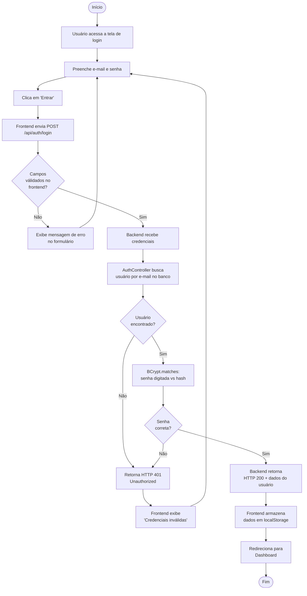
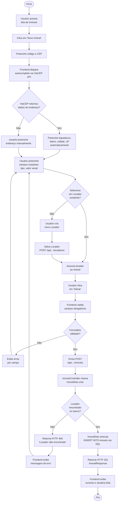
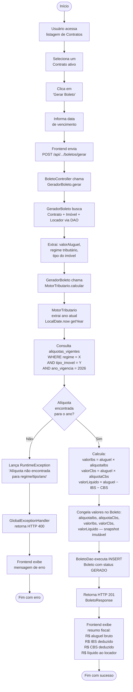

# Fase 6 — Diagramas de Atividades UML

**Projeto:** ImobFiscal
**PI:** 2º Semestre DSM — FATEC Indaiatuba
**Data:** 2026-06-02

---

## 1. O que é um Diagrama de Atividades

O Diagrama de Atividades é um diagrama UML comportamental que representa o fluxo de
controle de um processo — uma sequência de passos, com pontos de decisão (losangos),
ramificações e estados terminais. Ele responde à pergunta: "o que acontece, passo a passo,
quando o usuário realiza esta ação?"

No ImobFiscal, os diagramas de atividades complementam os Casos de Uso (que mostram
**quem** faz **o quê**) com a sequência detalhada de passos e as condições que alteram o
caminho percorrido.

Convenções usadas nos diagramas abaixo:

- Nó inicial: círculo preenchido (`([Início])`).
- Nó final: círculo com borda dupla (`([Fim])`).
- Atividade: retângulo arredondado.
- Decisão: losango — sai com uma condição `[sim]` e outra `[não]`.

---

## 2. Diagrama A — Fluxo de Login e Autenticação

### Fluxo A — diagrama

### Fluxo A — explicação

O processo começa quando o usuário acessa a tela de login e preenche o formulário. Há dois
pontos de decisão relevantes.

O primeiro ponto de decisão ocorre no frontend: se os campos estiverem vazios ou mal
formatados, o erro é apresentado imediatamente, sem enviar requisição ao servidor. Esse
comportamento reduz requisições desnecessárias e melhora a experiência do usuário.

O segundo e o terceiro pontos de decisão ocorrem no backend. O `AuthController` busca
diretamente no banco se o e-mail existe (via `UsuarioDao`). Se não existir, retorna HTTP
401. Se existir, o BCrypt compara o hash armazenado com o hash da senha digitada
(`BCryptPasswordEncoder.matches()`). Se não bater, também retorna 401. A mensagem de erro
do frontend é genérica em ambos os casos ("Credenciais inválidas") — isso é deliberado
para não revelar se o e-mail existe ou não no sistema.

A API é aberta: não há filtro JWT interceptando requisições. Somente quando os dois checks
passam o backend retorna HTTP 200 com os dados do usuário (sem token JWT). O frontend
armazena esses dados em `localStorage` para manter a sessão.

---

## 3. Diagrama B — Cadastro de Imóvel

### Fluxo B — diagrama

### Fluxo B — explicação

O cadastro de imóvel tem três pontos de decisão que estruturam o processo.

O primeiro é o autocomplete de CEP: ao sair do campo CEP, o frontend consulta a ViaCEP
(serviço público gratuito) e preenche logradouro, bairro, cidade e UF automaticamente.
Se a API não responder ou o CEP não existir, o usuário preenche o endereço manualmente —
o fluxo não trava.

O segundo ponto de decisão é a associação ao Locador. O imóvel precisa estar vinculado a
um Locador existente (RN01). Se o locador ainda não está cadastrado, o usuário cria um
novo antes de continuar — o frontend oferece esse desvio sem precisar sair da tela de
imóveis.

O terceiro ponto de decisão está no backend. O `ImovelController` repassa a criação ao
`ImovelDao`, que verifica via SQL se o Locador existe (defesa em profundidade). Se não
existir, retorna HTTP 400. Só após essa validação o DAO executa o `INSERT INTO imoveis`
com `JdbcTemplate` e a resposta 201 é devolvida ao frontend.

---

## 4. Diagrama C — Geração de Boleto com Cálculo Fiscal

### Fluxo C — diagrama

### Fluxo C — explicação

O processo de geração de boleto é onde o Motor Tributário entra em cena. O fluxo envolve
três camadas do backend trabalhando em sequência.

Primeiro, o `BoletoController` aciona `GeradorBoleto.gerar()` (classe em `model/`), que
carrega o contexto completo via DAOs: o contrato selecionado, o imóvel associado a ele e
o locador dono do imóvel. Esses dados fornecem os três parâmetros necessários para o
cálculo: `valorAluguel`, regime tributário do locador e tipo do imóvel.

O ponto de decisão central é a consulta à tabela `aliquotas_vigentes`. O `MotorTributario`
(classe em `model/`) extrai o ano atual dinamicamente (`LocalDate.now().getYear()`) e
busca via SQL a linha que combina regime + tipo + ano. Se não existir essa combinação no
banco, o sistema lança uma exceção e retorna HTTP 400 com mensagem descritiva — isso pode
ocorrer se o banco não tiver sido populado com as alíquotas do ano em vigor.

Quando a alíquota é encontrada, o cálculo usa `BigDecimal` com arredondamento `HALF_UP`
(padrão fiscal brasileiro): 4 casas decimais para IBS e CBS, 2 casas para o valor líquido
final. Imediatamente após o cálculo, os valores são **congelados** no registro de boleto —
as alíquotas do momento da emissão são gravadas junto com os valores calculados. Isso
garante que, mesmo se as alíquotas mudarem no banco para o ano seguinte, o boleto já
emitido permanece com os dados fiscais do dia em que foi gerado, atendendo às exigências
de rastreabilidade fiscal da Receita Federal.

---

_Verificado contra: `docs/03-casos-de-uso.md`, código em `backend/` — Spring Boot 3.3.0, Java 17, JdbcTemplate (sem Hibernate/JPA, sem JWT)._
_Última atualização: 2026-06-02._
