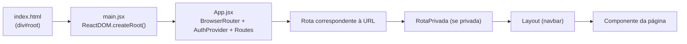
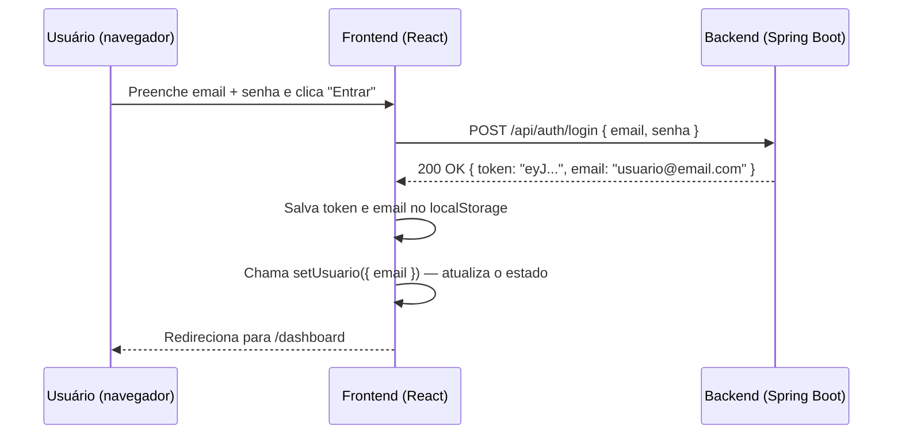
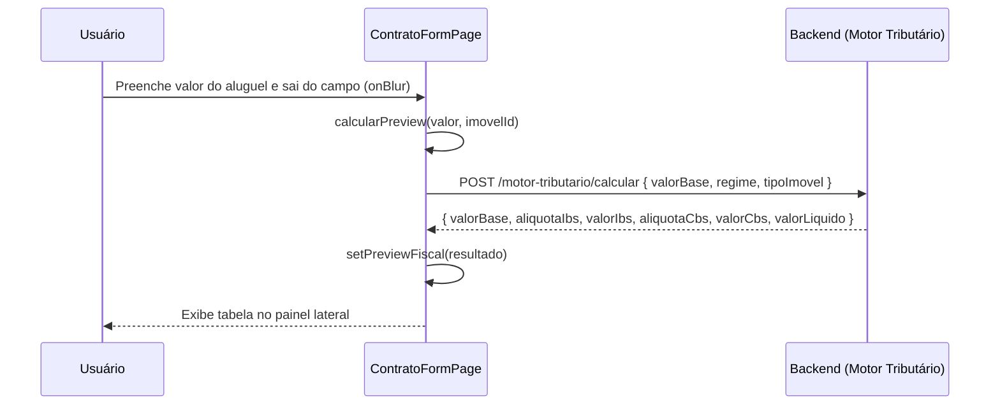

# Frontend do ImobFiscal — Guia de Estudo para a Banca

> Este documento explica como o frontend do ImobFiscal foi construído, por que
> cada decisão foi tomada e o que cada parte faz. Leia do início ao fim uma vez;
> depois use as seções como referência rápida antes da defesa.

---

## 1. O que é o frontend e qual é o papel dele

Imagine uma lanchonete. O **frontend** é o balcão de atendimento: é o que o
cliente vê, toca e interage — o cardápio na parede, os botões do caixa, a
bandeja com o pedido. O **backend** é a cozinha: recebe o pedido, prepara a
comida (processa os dados) e devolve o resultado. O cliente nunca entra na
cozinha.

No ImobFiscal:

- O **frontend** é a interface web que roda no navegador do usuário. Ele exibe
  formulários, tabelas e dashboards, e envia pedidos ao backend quando o usuário
  clica em algo.
- O **backend** (Spring Boot) é o servidor que fica no Railway. Ele lê e grava
  no banco de dados PostgreSQL e aplica as regras de negócio (inclusive o motor
  tributário).

O frontend nunca toca diretamente no banco de dados. Toda informação passa pelo
backend via chamadas HTTP — como um garçom que leva o pedido à cozinha e traz
o prato de volta.

---

## 2. Conceitos-base — do zero ao necessário

Antes de entrar no código, é preciso dominar o vocabulário. A banca vai usar
esses termos; você precisa usá-los com segurança.

### 2.1 SPA — Single Page Application

Uma aplicação web tradicional funciona assim: você clica em um link, o servidor
envia uma nova página HTML completa, o navegador descarta a página atual e
renderiza a nova. Parece recarregar o site inteiro a cada clique.

Uma **SPA (Single Page Application, ou Aplicação de Página Única)** funciona
diferente: o servidor entrega **uma única página HTML** no primeiro acesso. A
partir daí, o JavaScript controla tudo — troca de conteúdo, navegação entre
"páginas" — sem recarregar o navegador. É como um aplicativo instalado que usa
o navegador como janela.

Vantagens da SPA: navegação mais rápida (sem recarregar HTML completo),
experiência mais próxima de um aplicativo nativo.

O ImobFiscal é uma SPA construída com React.

### 2.2 React

**React** é uma biblioteca JavaScript criada pelo Facebook (Meta) para construir
interfaces de usuário. A ideia central é simples: a interface é descrita como
uma árvore de **componentes** e o React se encarrega de atualizar a tela quando
os dados mudam — você não precisa manipular o HTML diretamente.

### 2.3 Componente

Um **componente** é um bloco de construção da interface, como uma peça de
LEGO. Pode ser algo simples (um botão, uma notificação) ou complexo (uma página
inteira com formulário e tabela).

No React, cada componente é uma **função JavaScript** que retorna o que deve
ser exibido na tela. Exemplo real do projeto:

```jsx
// frontend/src/components/RotaPrivada.jsx
function RotaPrivada({ children }) {
  const { usuario } = useAuth()
  if (!usuario) {
    return <Navigate to="/login" replace />
  }
  return children
}
```

Este componente recebe outros componentes como "filhos" (`children`) e decide
se os exibe ou redireciona o usuário para `/login`.

### 2.4 JSX

**JSX** é uma sintaxe especial que mistura JavaScript com algo parecido com
HTML. O trecho `<Navigate to="/login" replace />` acima é JSX — não é HTML
puro nem JavaScript puro. O Vite (a ferramenta de build) converte o JSX em
chamadas JavaScript puras antes de enviar ao navegador.

### 2.5 Props

**Props** (abreviação de *properties*, propriedades) são os parâmetros que um
componente recebe de quem o chama. Funcionam como os argumentos de uma função.

No exemplo acima, `children` e, em outros casos, `mensagem` e `tipo` são props.
No componente `Toast`:

```jsx
// frontend/src/components/Toast.jsx
function Toast({ mensagem, tipo = 'success', onFechar }) { ... }
```

Quem usa o `Toast` passa `mensagem`, `tipo` e `onFechar` — assim como você
passa argumentos para uma função.

### 2.6 Estado (state) e `useState`

**Estado** é a memória interna de um componente — dados que podem mudar ao
longo do tempo e que, quando mudam, fazem o React redesenhar a tela.

O **hook `useState`** é a função do React que cria um estado. Ela retorna dois
itens: o valor atual do estado e uma função para alterá-lo.

Exemplo do `SimuladorFiscalPage`:

```jsx
// frontend/src/pages/SimuladorFiscalPage.jsx
const [valorBase, setValorBase] = useState('')
const [resultado, setResultado] = useState(null)
const [calculando, setCalculando] = useState(false)
```

- `valorBase` começa como string vazia. Quando o usuário digita no campo, o
  componente chama `setValorBase(novoValor)` e o React redesenha o campo.
- `resultado` começa como `null`. Quando o cálculo retorna, vira um objeto com
  os valores fiscais e o React exibe a tabela de resultados.
- `calculando` é um booleano que controla o spinner de "Calculando...".

### 2.7 Efeito e `useEffect`

**Efeitos** são ações que acontecem fora do fluxo normal de renderização: buscar
dados do servidor, configurar um timer, inscrever-se em eventos do navegador.

O **hook `useEffect`** recebe uma função e uma lista de dependências. A função
roda depois que o componente é exibido na tela. A lista de dependências diz
*quando* re-executar o efeito — uma lista vazia `[]` significa "execute apenas
uma vez, quando o componente for montado".

Exemplo do `DashboardPage`:

```jsx
// frontend/src/pages/DashboardPage.jsx
useEffect(() => {
  async function carregar() {
    const [resImoveis, resContratos, resBoletos] = await Promise.all([
      listarImoveis(),
      listarContratos(),
      listarBoletos(),
    ])
    setImoveis(resImoveis.data)
    setContratos(resContratos.data)
    setBoletos(resBoletos.data)
  }
  carregar()
}, []) // <-- [] = roda só quando o componente é montado
```

Ao abrir o dashboard, esse efeito dispara três chamadas ao backend ao mesmo
tempo (`Promise.all`) e, quando todas respondem, atualiza os estados.

### 2.8 Hook

**Hook** é qualquer função do React cujo nome começa com `use`. Os hooks são a
forma moderna (desde React 16.8) de adicionar funcionalidades (estado, efeitos,
contexto) a componentes funcionais.

Hooks usados no projeto:

| Hook | Para que serve |
|---|---|
| `useState` | Cria um estado no componente |
| `useEffect` | Executa código após renderização (buscar dados, timers) |
| `useContext` | Lê um contexto (ex.: dados do usuário logado) |
| `useNavigate` | Redireciona o usuário para outra rota por código |
| `useParams` | Lê parâmetros da URL, como o `:id` em `/imoveis/:id` |
| `useCallback` | Memoriza uma função para não recriá-la desnecessariamente |
| `useSearchParams` | Lê query strings como `?contratoId=...` da URL |

### 2.9 Contexto

**Contexto** (`Context`) é um mecanismo do React para compartilhar dados entre
componentes sem precisar passar props manualmente por cada nível intermediário.
É como um "quadro de avisos" global dentro da aplicação: qualquer componente
pode ler o que está nele.

O projeto usa contexto para autenticação: o `AuthContext` disponibiliza o
usuário logado, a função de login e a função de logout para qualquer componente
do sistema.

### 2.10 Roteamento no lado do cliente

Em uma SPA, não existe navegação real para novas páginas — o JavaScript simula
a troca de URL e de conteúdo. Isso é chamado de **roteamento no lado do cliente**
(*client-side routing*).

A biblioteca **React Router DOM** faz esse trabalho no ImobFiscal. Ela lê a URL
atual do navegador e renderiza o componente correspondente, sem jamais fazer uma
nova requisição ao servidor.

---

## 3. Stack — cada ferramenta e por que ela está aqui

| Ferramenta | Versão | Papel |
|---|---|---|
| **React** | 18.3 | Biblioteca de UI — componentes, estado, re-renderização |
| **react-dom** | 18.3 | Liga o React ao DOM do navegador (a página HTML) |
| **react-router-dom** | 6.23 | Roteamento no cliente — controla qual página exibir para cada URL |
| **axios** | 1.7 | Cliente HTTP — faz as chamadas ao backend de forma mais ergonômica que o `fetch` nativo |
| **Vite** | 5.3 | Ferramenta de build e servidor de desenvolvimento — compila JSX, serve o projeto localmente com hot-reload |
| **Bootstrap** | 5.3 (CDN) | Framework CSS — grid, botões, tabelas, formulários, badges |
| **Bootstrap Icons** | 1.11 (CDN) | Ícones vetoriais (`bi-house`, `bi-calculator`, etc.) |

> Nota sobre o que **não** está aqui: o projeto não usa TypeScript, Redux,
> biblioteca de formulários (como React Hook Form) nem framework de testes no
> frontend. Isso é uma escolha consciente de simplicidade para o MVP acadêmico.

---

## 4. Como o app "liga" — a cadeia de inicialização

Quando você abre o ImobFiscal no navegador, isso acontece:



**Passo a passo:**

1. **`index.html`** — O servidor entrega este único arquivo HTML. Ele tem apenas
   um `<div id="root"></div>` vazio e carrega Bootstrap via CDN. O Vite injeta
   o script `main.jsx` aqui.

2. **`main.jsx`** — É o ponto de entrada JavaScript. Ele "monta" o React dentro
   do `div#root`:
   ```jsx
   // frontend/src/main.jsx
   ReactDOM.createRoot(document.getElementById('root')).render(
     <React.StrictMode>
       <App />
     </React.StrictMode>
   )
   ```

3. **`App.jsx`** — O componente raiz. Ele configura três camadas:
   - `BrowserRouter`: habilita o roteamento via URL real (ex.: `/imoveis`).
   - `AuthProvider`: disponibiliza os dados de autenticação para todos os
     componentes filhos.
   - `Routes`: mapeia cada URL para um componente de página.

A partir daí, o React controla tudo. O navegador nunca pede uma nova página ao
servidor; ele apenas atualiza o que está dentro do `div#root`.

---

## 5. As rotas — mapa de navegação

Uma **rota** associa uma URL a um componente. O ImobFiscal tem 16 rotas.

### Rotas públicas

Qualquer pessoa pode acessar, mesmo sem estar logada:

| URL | Componente | Descrição |
|---|---|---|
| `/login` | `LoginPage` | Formulário de email e senha |
| `/cadastro` | `CadastroPage` | Criação de nova conta |

### Rotas privadas

Só acessíveis por usuários autenticados. Todas ficam dentro de `<RotaPrivada>`
e `<Layout>`:

| URL | Componente | Descrição |
|---|---|---|
| `/dashboard` | `DashboardPage` | Visão geral com 6 cards de resumo |
| `/imoveis` | `ImoveisPage` | Tabela de todos os imóveis |
| `/imoveis/novo` | `ImovelFormPage` | Cadastro de novo imóvel |
| `/imoveis/:id/editar` | `ImovelFormPage` | Edição de imóvel existente |
| `/imoveis/:id` | `ImovelDetalhePage` | Ficha completa do imóvel |
| `/locadores` | `LocadoresPage` | Lista de locadores |
| `/locadores/novo` | `LocadorFormPage` | Cadastro de locador |
| `/locadores/:id/editar` | `LocadorFormPage` | Edição de locador |
| `/contratos` | `ContratosPage` | Lista de contratos com ações de status |
| `/contratos/novo` | `ContratoFormPage` | Novo contrato com preview fiscal |
| `/simulador-fiscal` | `SimuladorFiscalPage` | Calculadora avulsa de IBS/CBS |
| `/boletos` | `BoletosPage` | Lista e geração de boletos |

### Rotas especiais

| URL | Comportamento |
|---|---|
| `/` | Redireciona para `/dashboard` |
| `*` (qualquer outra URL) | Redireciona para `/login` |

O símbolo `:id` nas URLs é um **parâmetro de rota** — um trecho variável.
`/imoveis/abc-123` e `/imoveis/xyz-456` usam o mesmo componente `ImovelDetalhePage`;
o componente lê o valor concreto com `useParams()`.

### Rota privada vs. rota pública

A proteção de rotas é implementada no componente `RotaPrivada`. Toda rota que
precisa de login é envolvida por ele no `App.jsx`. A lógica é direta:

```jsx
// frontend/src/components/RotaPrivada.jsx
function RotaPrivada({ children }) {
  const { usuario } = useAuth()
  if (!usuario) {
    return <Navigate to="/login" replace />
  }
  return children
}
```

Se o estado `usuario` for `null` (não há ninguém logado), o componente renderiza
um redirecionamento para `/login`. Caso contrário, renderiza os `children`
normalmente.

---

## 6. Autenticação no frontend — passo a passo

### O que é JWT

**JWT (JSON Web Token)** é um padrão para transmitir informações de forma
segura entre duas partes. No contexto de autenticação, funciona assim: após o
login bem-sucedido, o servidor gera um "crachá digital" (o token) e o entrega
ao cliente. A partir daí, o cliente apresenta esse crachá em todas as
requisições. O servidor valida o crachá e sabe quem está pedindo.

O JWT é uma string codificada com três partes separadas por ponto
(`header.payload.signature`). Ele não precisa ser armazenado no servidor —
o próprio token contém as informações necessárias para validação.

> **Atualização — refatoração do backend:**
> O backend deixou de usar JWT. A API é agora aberta (sem Spring Security).
> O frontend continua idêntico — guarda e envia o valor retornado pelo login
> no cabeçalho `Authorization: Bearer ...` — mas esse valor virou apenas um
> marcador de sessão simples que a API não valida. O login continua conferindo
> email e senha no servidor com BCrypt; login inválido retorna 401 e email
> duplicado no cadastro retorna 409. O restante do fluxo descrito abaixo
> reflete o comportamento real do frontend.

### O fluxo de login



O código correspondente no `AuthContext`:

```jsx
// frontend/src/contexts/AuthContext.jsx
async function fazerLogin(email, senha) {
  const resposta = await loginApi(email, senha)
  const { token, email: emailRetornado } = resposta.data

  localStorage.setItem('imobfiscal_token', token)
  localStorage.setItem('imobfiscal_email', emailRetornado)

  setUsuario({ email: emailRetornado })
}
```

### Persistência da sessão (F5 não desloga)

Ao recarregar a página, o React "esquece" todos os estados. Para que o usuário
não precise logar de novo a cada F5, o estado inicial do `AuthContext` já lê
o `localStorage`:

```jsx
// frontend/src/contexts/AuthContext.jsx
const [usuario, setUsuario] = useState(() => {
  const token = localStorage.getItem('imobfiscal_token')
  const email = localStorage.getItem('imobfiscal_email')
  return token && email ? { email } : null
})
```

Se o token existir no `localStorage`, o usuário já começa logado.

### Logout

```jsx
// frontend/src/contexts/AuthContext.jsx
function fazerLogout() {
  localStorage.removeItem('imobfiscal_token')
  localStorage.removeItem('imobfiscal_email')
  setUsuario(null)
}
```

Remove as chaves do `localStorage` e zera o estado — o React imediatamente
redireciona para `/login` porque `RotaPrivada` agora vê `usuario === null`.

### Interceptor — o carimbo automático

Toda requisição ao backend precisa levar o token JWT no cabeçalho HTTP
`Authorization`. Em vez de adicionar esse cabeçalho manualmente em cada chamada,
o `api.js` usa um **interceptor** — um interceptador que o Axios executa
*antes* de enviar qualquer requisição:

```jsx
// frontend/src/services/api.js
api.interceptors.request.use((config) => {
  const token = localStorage.getItem('imobfiscal_token')
  if (token) {
    config.headers.Authorization = `Bearer ${token}`
  }
  return config
})
```

Pense no interceptor como um funcionário que, antes de cada carta sair da
empresa, abre o envelope e coloca o crachá do remetente dentro. Todos os
componentes chamam as funções do `api.js` normalmente; o interceptor cuida do
cabeçalho de autenticação sem que ninguém precise lembrar.

O formato `Bearer <token>` é o padrão da especificação HTTP para autenticação
com tokens.

---

## 7. A camada de serviços — `api.js`

### O que é Axios

**Axios** é uma biblioteca JavaScript para fazer requisições HTTP. Ela é mais
ergonômica que o `fetch` nativo: converte automaticamente o corpo da resposta
para objeto JavaScript, trata erros HTTP como exceções e permite configurar
instâncias com opções padrão.

### A instância configurada

```jsx
// frontend/src/services/api.js
const api = axios.create({
  baseURL: import.meta.env.VITE_API_URL || '/api',
})
```

`import.meta.env.VITE_API_URL` é uma **variável de ambiente** injetada pelo
Vite. Em produção (Vercel), ela aponta para o backend no Railway. Em
desenvolvimento local, ela não existe, então a `baseURL` cai para `/api`.

### O proxy do Vite e o problema de CORS

**CORS (Cross-Origin Resource Sharing)** é uma política de segurança dos
navegadores: por padrão, um site em `http://localhost:5173` não pode fazer
chamadas para `http://localhost:8080` (porta diferente = origem diferente).

Para resolver isso em desenvolvimento sem mexer no backend, o `vite.config.js`
configura um **proxy**:

```js
// frontend/vite.config.js
proxy: {
  '/api': {
    target: 'http://localhost:8080',
    changeOrigin: true,
  }
}
```

Quando o frontend chama `/api/auth/login`, o Vite intercepta a requisição e
a repassa para `http://localhost:8080/api/auth/login`. Do ponto de vista do
navegador, a chamada vai para o próprio servidor do Vite (mesma origem) — sem
CORS. Em produção, o Vercel e o Railway estão configurados para se comunicar
diretamente.

### O IMOBILIARIA_ID fixo

```jsx
// frontend/src/services/api.js
const IMOBILIARIA_ID = '11111111-1111-1111-1111-111111111111'
```

Todas as rotas de recursos (imóveis, locadores, contratos, boletos) seguem o
padrão `/imobiliarias/{id}/...`. Para o MVP, o ID da imobiliária está fixo em
código. Isso é uma limitação conhecida — em produção, esse valor deveria vir
do perfil do usuário logado (decodificado do JWT). A seção 12 trata isso
explicitamente.

---

## 8. Passeio pelas páginas

### LoginPage e CadastroPage

Rotas públicas. Formulários simples que chamam `fazerLogin` (do contexto) e
`cadastrar` (do `api.js`), respectivamente. O `CadastroPage` trata
especificamente o erro HTTP 409 (conflito), que o backend retorna quando o
email já está cadastrado, e exibe uma mensagem amigável ao usuário.

### DashboardPage

Página inicial pós-login. Usa `useEffect` com `Promise.all` para carregar
imóveis, contratos e boletos ao mesmo tempo (em paralelo, não sequencialmente).
Exibe 6 cards de resumo: total de imóveis, residenciais, comerciais, valor
do portfólio, contratos ativos e boletos gerados.

### ImoveisPage

Tabela com todos os imóveis. A exclusão usa `window.confirm` para pedir
confirmação antes de chamar `excluirImovel`. Se o backend retornar HTTP 401
(não autorizado), a página chama `fazerLogout` — proteção básica contra
sessão expirada.

### ImovelFormPage

O maior componente do projeto (~880 linhas). Serve para **criar e editar**
imóveis usando o mesmo código — uma técnica chamada formulário dual. Ele
detecta o modo de operação verificando se existe um `:id` na URL:

```jsx
const modoEdicao = Boolean(id)  // id vem do useParams()
```

Funcionalidades notáveis:
- **Autocomplete de CEP**: ao sair do campo CEP (`onBlur`), o componente faz
  uma requisição à API pública [ViaCEP](https://viacep.com.br) e preenche
  automaticamente logradouro, bairro, cidade e UF.
- **Modal de criação rápida de locador**: o formulário tem um combobox de
  locadores com um botão "+" que abre um modal inline para cadastrar um
  locador sem sair da tela.

### LocadoresPage e LocadorFormPage

Lista e formulário de locadores. O formulário alterna entre campos de
Pessoa Física (CPF) e Pessoa Jurídica (CNPJ) com um radio button. A lista
exibe o regime tributário de cada locador em badges coloridas.

### ContratosPage

Exibe contratos com seus status (`RASCUNHO`, `ATIVO`, `RESCINDIDO`,
`ENCERRADO`). Para contratos ativos, há um botão "Rescindir" que chama
`PATCH /contratos/{id}/status?status=RESCINDIDO`. Para rascunhos, há
"Ativar".

### ContratoFormPage — o mais rico

Descrita em detalhe na seção 10, por conta do preview fiscal ao vivo.

### SimuladorFiscalPage

Calculadora avulsa para IBS e CBS. O usuário preenche valor, regime
tributário e tipo de imóvel e clica "Calcular". O resultado mostra:

- Valor total do aluguel
- IBS retido (com alíquota percentual)
- CBS retida (com alíquota percentual)
- Valor líquido ao locador
- Confirmação de que o Split Payment está ativo

Não há estado persistido — cada cálculo é independente.

### BoletosPage

Lista boletos existentes e oferece um formulário para gerar novos via
`POST .../boletos/gerar`. Aceita o parâmetro `?contratoId=` na URL (lido
com `useSearchParams`), o que permite que a `ContratosPage` abra a tela de
boletos já com o contrato pré-selecionado.

---

## 9. Componentes reutilizáveis

O projeto tem quatro componentes que servem a múltiplas páginas:

### Layout

Envolve todas as páginas autenticadas. Fornece a navbar fixa no topo com:
- Logo "ImobFiscal" clicável (vai para `/dashboard`)
- Links de navegação: Imóveis, Locadores, Contratos, Simulador, Boletos
- Email do usuário logado (lido do `AuthContext`)
- Botão "Sair" que chama `fazerLogout` e redireciona para `/login`

O conteúdo da página vai em `{children}`, abaixo da navbar.

### RotaPrivada

Guarda de rota com 12 linhas. Descrito em detalhes na seção 5.

### Toast

Notificação flutuante no canto inferior direito da tela. Fecha-se
automaticamente após 3 segundos usando `useEffect` com `setTimeout`.
O tipo pode ser `'success'` (verde) ou `'danger'` (vermelho).

```jsx
// frontend/src/components/Toast.jsx
useEffect(() => {
  const timer = setTimeout(onFechar, 3000)
  return () => clearTimeout(timer)
}, [onFechar])
```

A função retornada pelo `useEffect` é uma **função de limpeza**: ela cancela
o timer se o componente for desmontado antes dos 3 segundos (evita vazamento
de memória).

### Breadcrumb

Exibe a trilha de navegação: `Início > Contratos > Novo`. Recebe as props
`pagina` e `sub` (opcional). Usado em todas as páginas de formulário.

---

## 10. Padrões de código

### Padrão de busca de dados

Todas as páginas seguem o mesmo padrão ao buscar dados do backend:

```jsx
const [dados, setDados] = useState([])
const [carregando, setCarregando] = useState(true)
const [erro, setErro] = useState(null)

useEffect(() => {
  async function carregar() {
    setCarregando(true)
    try {
      const resposta = await minhaFuncaoDaApi()
      setDados(resposta.data)
    } catch (err) {
      setErro('Mensagem de erro amigável')
    } finally {
      setCarregando(false)  // executa sempre, erro ou não
    }
  }
  carregar()
}, [])
```

O `finally` garante que `carregando` volta a `false` mesmo se a requisição
falhar — sem isso, o spinner giraria para sempre.

### Preview fiscal ao vivo com `useCallback`

A `ContratoFormPage` tem um recurso diferenciado: enquanto o usuário preenche
o formulário de contrato, um painel lateral mostra em tempo real o cálculo de
IBS e CBS para aquele valor de aluguel.



A função `calcularPreview` usa **`useCallback`** — um hook que memoriza a
função e só a recria quando suas dependências mudam (`[imoveis]`). Sem isso,
a função seria recriada a cada renderização, podendo causar chamadas
desnecessárias ao backend.

```jsx
// frontend/src/pages/ContratoFormPage.jsx
const calcularPreview = useCallback(async (valor, imvId) => {
  if (!valor || !imvId || parseFloat(valor) <= 0) {
    setPreviewFiscal(null)
    return
  }
  const imovel = imoveis.find((i) => i.id === imvId)
  setCalculando(true)
  try {
    const resposta = await calcularImposto({ valorBase: parseFloat(valor), regime: 'PF', tipoImovel: imovel.tipo })
    setPreviewFiscal(resposta.data)
  } catch {
    setPreviewFiscal(null)
  } finally {
    setCalculando(false)
  }
}, [imoveis])
```

### Formatação de moeda

Todos os valores monetários são formatados com a API nativa do JavaScript:

```jsx
new Intl.NumberFormat('pt-BR', { style: 'currency', currency: 'BRL' }).format(valor)
// Resultado: "R$ 3.000,00"
```

Isso garante separador de milhar com ponto, vírgula decimal e símbolo `R$`,
seguindo o padrão brasileiro — sem biblioteca externa.

---

## 11. Deploy na Vercel e o rewrite de SPA

O frontend é publicado na **Vercel**, uma plataforma de hospedagem para
aplicações estáticas e serverless.

O `vite build` gera uma pasta `dist/` com arquivos estáticos (HTML, CSS,
JS). A Vercel serve esses arquivos.

### O problema do F5 em uma SPA

Quando o usuário está em `/imoveis` e aperta F5, o navegador pede ao servidor
o arquivo `/imoveis`. Em um site estático, esse arquivo não existe — resultado:
erro 404.

### A solução: rewrite

O arquivo `vercel.json` resolve isso com uma única regra:

```json
{
  "rewrites": [
    { "source": "/(.*)", "destination": "/index.html" }
  ]
}
```

Isso diz à Vercel: "qualquer URL que chegue, sirva o `index.html`". O React
Router, ao receber o `index.html`, lê a URL atual e renderiza o componente
certo. O usuário vê a página correta; o servidor nunca precisou de um arquivo
chamado `/imoveis`.

---

## 12. Limitações honestas

Todo sistema tem limitações. Reconhecer as suas demonstra maturidade técnica
— e a banca valoriza isso.

### Proteção de rota apenas no cliente

A `RotaPrivada` impede que uma rota seja *renderizada* sem login — é uma camada
de UX, não de segurança. E, neste MVP, **a API é aberta**: o backend não exige
token nem valida autenticação em nenhuma rota. Ou seja, alguém poderia acessar a
API diretamente (via Postman, por exemplo) sem fazer login. É uma limitação
consciente do projeto acadêmico — em produção, a API precisaria voltar a exigir
autenticação (ex.: JWT) em cada requisição.

### `IMOBILIARIA_ID` fixo

```jsx
// frontend/src/services/api.js
const IMOBILIARIA_ID = '11111111-1111-1111-1111-111111111111'
```

Em um sistema multitenancy real (onde várias imobiliárias usam o mesmo
sistema), cada usuário teria sua imobiliária associada à sua conta/sessão, e o
frontend usaria esse ID. No MVP acadêmico, o ID está fixo em código para
simplificar — é um atalho consciente.

### Sem testes automatizados no frontend

O projeto não tem testes unitários nem de integração no frontend (sem Vitest,
sem React Testing Library, sem Cypress). Em um projeto de produção, seria
essencial testar pelo menos os componentes críticos (`RotaPrivada`,
`AuthContext`, o preview fiscal). Aqui, a validação foi feita manualmente
durante o desenvolvimento.

### Tratamento de erro por página

Cada página tem seu próprio `try/catch` e exibe seus próprios erros. Não há
um tratamento centralizado (como um interceptor de resposta no Axios que
interceptasse erros 401 globalmente e redirecionasse para `/login`). A exceção
parcial é a `ImoveisPage`, que trata o 401 explicitamente e chama `fazerLogout`.

---

## 13. Mini-glossário

| Termo | Significado |
|---|---|
| **SPA** | Single Page Application — app web que carrega uma única página HTML e troca o conteúdo com JavaScript |
| **React** | Biblioteca JavaScript para construir interfaces de usuário baseadas em componentes |
| **Componente** | Função JavaScript que retorna JSX e representa um bloco da interface |
| **JSX** | Sintaxe que mistura JavaScript com HTML; convertida para JS pelo Vite |
| **Props** | Parâmetros passados a um componente por quem o chama |
| **Estado (state)** | Memória interna de um componente; quando muda, o React redesenha a tela |
| **Hook** | Função do React (prefixo `use`) que adiciona funcionalidades a componentes |
| **`useState`** | Hook para criar e atualizar estado |
| **`useEffect`** | Hook para efeitos colaterais (buscar dados, timers) |
| **`useContext`** | Hook para ler um contexto global |
| **`useCallback`** | Hook que memoriza uma função para evitar recriações desnecessárias |
| **`useParams`** | Hook para ler parâmetros de rota (`:id`) |
| **`useNavigate`** | Hook para redirecionar por código |
| **`useSearchParams`** | Hook para ler query strings (`?chave=valor`) |
| **Contexto** | Mecanismo para compartilhar dados globais sem passar props em cascata |
| **Roteamento** | Mecanismo que associa URLs a componentes (React Router DOM) |
| **JWT** | JSON Web Token — token de autenticação que o backend gera após o login |
| **Bearer Token** | Formato de autenticação HTTP: `Authorization: Bearer <token>` |
| **localStorage** | Armazenamento persistente do navegador (sobrevive ao F5) |
| **Interceptor** | Função que o Axios executa antes/depois de cada requisição HTTP |
| **Axios** | Biblioteca para fazer requisições HTTP de forma ergonômica |
| **Vite** | Ferramenta de build que compila JSX e serve o projeto em desenvolvimento |
| **Proxy (Vite)** | Redirecionamento de requisições `/api` para o backend em desenvolvimento, evitando CORS |
| **CORS** | Política de segurança do navegador que bloqueia chamadas entre origens diferentes |
| **Vercel** | Plataforma de hospedagem onde o frontend está publicado |
| **Rewrite** | Regra da Vercel que redireciona qualquer URL para `index.html` (necessário para SPA) |
| **Bootstrap** | Framework CSS que fornece grid, componentes e utilitários visuais |
| **`Promise.all`** | Executa múltiplas chamadas assíncronas em paralelo e aguarda todas concluírem |
| **Motor Tributário** | Serviço do backend que calcula IBS e CBS conforme a Reforma Tributária (LC 214/2025) |
| **Split Payment** | Mecanismo da Reforma Tributária onde IBS e CBS são retidos automaticamente no pagamento |
| **IBS** | Imposto sobre Bens e Serviços — substitui ICMS e ISS (estadual/municipal) |
| **CBS** | Contribuição sobre Bens e Serviços — substitui PIS e COFINS (federal) |

---

*Verificado contra o código-fonte na versão do repositório em 2026-06-02.*
