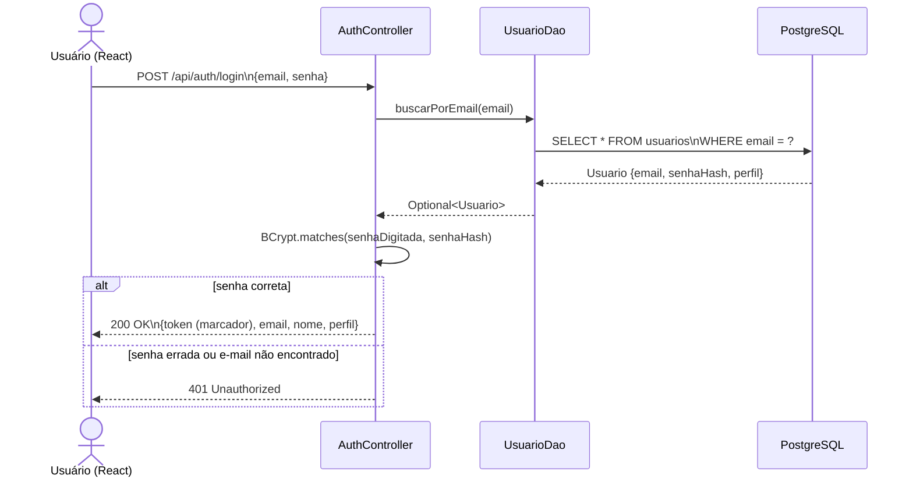
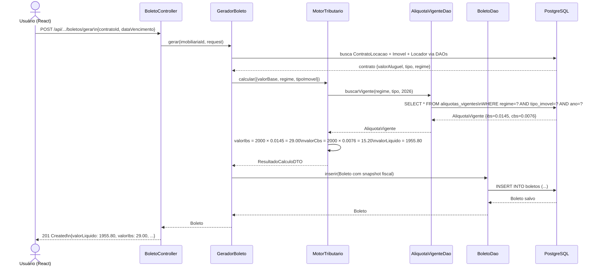

# Backend do ImobFiscal — Guia para a Banca

> Documento de estudo e defesa.
> Público-alvo: estudante de DSM que vai explicar o sistema para uma banca avaliadora.
> Verificado contra o código em `backend/` — versão Spring Boot 3.3.0, Java 17.

---

## Sumário

1. [O que é o backend e o que é uma API REST](#1-o-que-é-o-backend-e-o-que-é-uma-api-rest)
2. [Conceitos do zero](#2-conceitos-do-zero)
3. [Stack e dependências](#3-stack-e-dependências)
4. [Arquitetura em camadas — padrão MVC](#4-arquitetura-em-camadas--padrão-mvc)
5. [Autenticação simples (sem JWT)](#5-autenticação-simples-sem-jwt)
6. [Catálogo de endpoints](#6-catálogo-de-endpoints)
7. [O Motor Tributário](#7-o-motor-tributário)
8. [Modelos e conceitos de persistência](#8-modelos-e-conceitos-de-persistência)
9. [Tratamento de erros](#9-tratamento-de-erros)
10. [Testes automatizados](#10-testes-automatizados)
11. [Limitações honestas do sistema](#11-limitações-honestas-do-sistema)
12. [Mini-glossário](#12-mini-glossário)

---

## 1. O que é o backend e o que é uma API REST

### A metáfora do restaurante

Imagine o sistema dividido em três partes:

- **Salão (frontend):** o que o usuário vê — telas, botões, formulários.
- **Cozinha (backend):** onde o trabalho real acontece — regras de negócio, cálculos fiscais, acesso ao banco de dados.
- **Cofre (banco de dados):** onde os dados ficam guardados de forma permanente.

O **garçom** que carrega pedidos entre o salão e a cozinha é a **API** (_Application Programming Interface_, ou Interface de Programação de Aplicação). O garçom fala uma língua padronizada para que qualquer salão consiga se comunicar com qualquer cozinha.

### O que é uma API REST

**REST** (_Representational State Transfer_) é um conjunto de regras para essa comunicação. As principais regras são:

1. A comunicação usa o protocolo HTTP (o mesmo do navegador).
2. Cada recurso tem um endereço fixo chamado **endpoint** (ponto de entrada). Exemplo: `/api/imobiliarias/{id}/imoveis` é o endpoint dos imóveis.
3. A ação sobre o recurso é indicada pelo **verbo HTTP**: `GET` (buscar), `POST` (criar), `PUT` (atualizar tudo), `PATCH` (atualizar parte), `DELETE` (remover).
4. Os dados trafegam em **JSON** (_JavaScript Object Notation_), um formato de texto legível por humanos e máquinas.
5. O servidor não guarda memória entre requisições — cada chamada é independente. Isso se chama **stateless** (sem estado).

No ImobFiscal, o frontend em React faz chamadas HTTP para os endpoints do backend Spring Boot. O backend processa, acessa o banco PostgreSQL no Railway e devolve JSON.

---

## 2. Conceitos do zero

### Java e Spring Boot

**Java** é a linguagem de programação. **Spring Boot** é um framework — uma caixa de ferramentas que elimina configurações repetitivas e deixa o desenvolvedor focar na lógica de negócio. Spring Boot 3.3.0 com Java 17 é a combinação usada no ImobFiscal.

### Injeção de dependência

**Injeção de dependência** (_Dependency Injection_, DI) é quando uma classe não cria os objetos de que precisa — ela declara que precisa deles e o framework os entrega prontos.

Exemplo real do projeto ([`ImovelController.java`](../../backend/src/main/java/br/fatec/imobfiscal/controller/ImovelController.java)):

```java
@RestController
@RequiredArgsConstructor   // Lombok gera o construtor com todos os campos final
public class ImovelController {

    private final ImovelDao imovelDao;  // declaramos a dependência
    // Spring Boot injeta automaticamente uma instância de ImovelDao
}
```

Sem DI, o controller teria que escrever `new ImovelDao(new JdbcTemplate(...))` — código frágil e difícil de testar. Com DI, o Spring cuida disso. O `@Repository` e `@Component` marcam as classes que o Spring deve gerenciar.

### O que é MVC

**MVC** (_Model-View-Controller_) é um padrão que divide o sistema em três papéis:

- **Model** (modelo): os dados e as regras de negócio.
- **View** (visão): a representação dos dados para o mundo externo — no ImobFiscal, os DTOs JSON que entram e saem da API.
- **Controller** (controlador): recebe a requisição, coordena o Model e devolve a View.

No ImobFiscal, o padrão MVC é adotado de forma clássica e direta: o Controller chama o DAO ou a classe de negócio do Model sem passar por uma camada intermediária de Service.

### O que é SQL puro e por que usamos

Em muitos sistemas Java é comum usar um ORM (como Hibernate) que gera o SQL automaticamente a partir de classes Java. O ImobFiscal optou por uma abordagem diferente: **SQL puro escrito à mão**, executado via `JdbcTemplate`.

A vantagem didática é imediata: qualquer pessoa pode abrir o arquivo `ImovelDao.java` e ler exatamente o `SELECT` ou `INSERT` que será enviado ao banco — sem magia por baixo dos panos.

---

## 3. Stack e dependências

O arquivo [`backend/pom.xml`](../../backend/pom.xml) é o "cardápio de bibliotecas" do Maven (gerenciador de dependências do Java). Cada dependência declarada lá é baixada automaticamente.

| Dependência | Para que serve no ImobFiscal |
| --- | --- |
| `spring-boot-starter-web` | Criar endpoints REST com `@RestController` |
| `spring-boot-starter-jdbc` | Acesso ao banco com SQL puro via `JdbcTemplate` (substitui o JPA/Hibernate) |
| `spring-security-crypto` | Somente o BCrypt para hash de senha — sem o framework Security completo |
| `spring-boot-starter-validation` | Validar campos dos DTOs (`@NotBlank`, `@Email`, `@Size`) |
| `postgresql` | Driver JDBC para conectar ao banco PostgreSQL |
| `lombok` | Gerar getters, setters e construtores automaticamente em tempo de compilação |
| `spring-boot-starter-test` | JUnit 5 e Mockito para testes |

**Dependências removidas na refatoração:** `spring-boot-starter-data-jpa` (ORM/Hibernate), `spring-boot-starter-security` (framework completo de segurança), `jjwt-api`, `jjwt-impl`, `jjwt-jackson` (geração/validação JWT) e `spring-security-test`.

**Deploy:** o arquivo `railway.toml` configura o Railway para compilar com `mvn clean package -DskipTests` e executar `java -jar target/imobfiscal-backend-1.0.0.jar`.

---

## 4. Arquitetura em camadas — padrão MVC

O backend segue o **padrão MVC clássico**. Cada pasta do projeto tem um papel bem definido.

```mermaid
graph TD
    A[Cliente — React/Postman] -->|JSON via HTTP| B

    subgraph "Backend Spring Boot"
        B[Controller\n@RestController\nRecebe JSON, valida, coordena]
        B --> C[Model\nPOJOs de domínio sem anotações\nDAO com SQL puro\nRegras de negócio: MotorTributario GeradorBoleto]
        B --> V[View\nDTOs: Request e Response\nRepresentação JSON da API]
        C --> V
    end

    C -->|SQL via JdbcTemplate| F[(PostgreSQL\nRailway)]

    style B fill:#dbeafe,stroke:#3b82f6
    style C fill:#dcfce7,stroke:#16a34a
    style V fill:#fce7f3,stroke:#db2777
    style F fill:#f1f5f9,stroke:#64748b
```

### O que cada pasta faz

**`controller/` — camada de entrada**
Recebe a requisição HTTP, extrai os dados do JSON com `@RequestBody`, valida com `@Valid` e chama o DAO ou a classe de negócio do Model. Não contém lógica de negócio — só coordena entrada e saída. **Não existe mais camada de Service:** o controller fala diretamente com o Model.

**`model/` — dados e regras de negócio**
Subdividida em dois tipos de classe:

- **POJOs de domínio** (`Imovel`, `Locador`, `ContratoLocacao`, etc.): classes Java simples sem nenhuma anotação de banco. Guardam os dados. Herdam de `BaseModel` (que tem `id`, `createdAt`, `updatedAt` e `deletedAt`).
- **Classes de regra de negócio** (`MotorTributario`, `GeradorBoleto`): lógica mais pesada que antes ficaria em um Service. Anotadas com `@Component` para o Spring as gerenciar.
- **`model/dao/`** (`ImovelDao`, `LocadorDao`, etc.): classes anotadas com `@Repository` que executam SQL puro via `JdbcTemplate`. Cada DAO tem um `RowMapper` manual que traduz colunas do banco em campos Java.

**`view/` — representação JSON**
DTOs (_Data Transfer Objects_) que definem o que entra (`Request`) e o que sai (`Response`) da API. Ficam aqui as anotações de validação (`@NotBlank`, `@Email`). O DTO existe para não expor campos internos como `deletedAt` ou `senha` na resposta.

**`config/`** — configuração transversal (ex.: `WebConfig` para CORS).
**`exception/`** — `GlobalExceptionHandler` para centralizar o tratamento de erros.
**`enums/`** — constantes de domínio (`TipoImovel`, `RegimeTributario`, etc.).

### O que é um DAO e o que é um RowMapper

**DAO** (_Data Access Object_) é um padrão que isola todo o código de acesso ao banco numa classe só. Se você precisar mudar como um dado é buscado, mexe só no DAO — o controller não sabe nem percebe.

**RowMapper** é uma função que ensina ao `JdbcTemplate` como transformar uma linha de resultado do banco em um objeto Java. No ImobFiscal cada DAO tem o seu próprio, escrito à mão. Exemplo real do DAO de imóveis ([`ImovelDao.java`](../../backend/src/main/java/br/fatec/imobfiscal/model/dao/ImovelDao.java)):

```java
private Imovel mapRow(ResultSet rs, int rowNum) throws SQLException {
    Imovel i = new Imovel();
    i.setId(rs.getObject("id", UUID.class));
    i.setImobiliariaId(rs.getObject("imobiliaria_id", UUID.class));
    i.setLocadorId(rs.getObject("locador_id", UUID.class));
    i.setCodigo(rs.getString("codigo"));
    String tipo = rs.getString("tipo");
    i.setTipo(tipo != null ? TipoImovel.valueOf(tipo) : null);
    // ... demais campos ...
    return i;
}
```

### Exemplo end-to-end: criar um imóvel

Segue o caminho real de uma requisição `POST /api/imobiliarias/{id}/imoveis`:

**1. Controller recebe, valida e monta o POJO**
([`ImovelController.java`](../../backend/src/main/java/br/fatec/imobfiscal/controller/ImovelController.java))

```java
@PostMapping
public ResponseEntity<ImovelResponse> criar(
        @PathVariable UUID imobiliariaId,
        @Valid @RequestBody ImovelRequest request) {    // @Valid dispara as validações do DTO
    Imovel imovel = new Imovel();
    imovel.setImobiliariaId(imobiliariaId);
    imovel.setLocadorId(request.locadorId());           // opcional
    imovel.setCodigo(request.codigo());
    imovel.setTipo(request.tipo());
    // ... demais campos ...

    ImovelResponse response = ImovelResponse.from(imovelDao.inserir(imovel));
    return ResponseEntity.status(201).body(response);  // 201 Created
}
```

**2. DAO gera o id, as datas e executa o INSERT**
([`ImovelDao.java`](../../backend/src/main/java/br/fatec/imobfiscal/model/dao/ImovelDao.java))

```java
public Imovel inserir(Imovel imovel) {
    imovel.setId(UUID.randomUUID());         // id gerado em Java
    LocalDateTime agora = LocalDateTime.now();
    imovel.setCreatedAt(agora);
    imovel.setUpdatedAt(agora);

    String sql = """
            INSERT INTO imoveis
                (id, imobiliaria_id, locador_id, codigo, tipo, ...)
            VALUES (?, ?, ?, ?, ?, ...)
            """;
    jdbcTemplate.update(sql,
            imovel.getId(),
            imovel.getImobiliariaId(),
            imovel.getLocadorId(),
            imovel.getCodigo(),
            imovel.getTipo() != null ? imovel.getTipo().name() : null,
            // ...
    );
    return imovel;
}
```

**3. DTO de resposta é montado e serializado em JSON**
`ImovelResponse.from(imovel)` copia apenas os campos seguros para um record Java. O Spring serializa esse objeto como JSON e devolve ao cliente com status 201.

Perceba que não há nenhum Service entre o Controller e o DAO. O fluxo é direto: Controller → DAO → banco.

---

## 5. Autenticação simples (sem JWT)

### A decisão: API aberta

Na versão anterior do projeto, a API usava JWT e Spring Security completo. Na refatoração, essa camada foi **removida intencionalmente**.

A API do ImobFiscal se comunica exclusivamente com o próprio frontend do projeto. Não é uma API pública. Para um MVP acadêmico, manter JWT adicionaria complexidade (filtros, chave secreta, expiração de token, refresh token) sem benefício real — a banca poderia testar qualquer endpoint sem precisar se autenticar, o que dificulta a demonstração.

A decisão está documentada no próprio código ([`AuthController.java`](../../backend/src/main/java/br/fatec/imobfiscal/controller/AuthController.java)):

```java
// IMPORTANTE: a API NÃO usa mais JWT — comunicação só com o frontend deste sistema.
// O login apenas confere e-mail + senha no banco e devolve os dados do usuário.
// As demais rotas da API são abertas.
```

### O que o BCrypt ainda faz

Mesmo sem JWT, a **senha continua protegida**. O BCrypt é um algoritmo de hash de mão única: dada a senha `"minhasenha123"`, ele gera algo como `"$2a$10$Kz..."` — e é impossível reverter o hash para descobrir a senha original.

Quando o usuário faz login, o sistema compara o hash armazenado no banco com o hash da senha digitada. A senha nunca fica em texto puro no banco.

A biblioteca usada é `spring-security-crypto` — apenas a parte de criptografia do Spring Security, sem o framework completo.

### Como o login funciona

([`AuthController.java`](../../backend/src/main/java/br/fatec/imobfiscal/controller/AuthController.java)):

```java
@PostMapping("/login")
public ResponseEntity<LoginResponse> login(@Valid @RequestBody LoginRequest request) {
    Usuario usuario = usuarioDao.buscarPorEmail(request.email())
            .orElseThrow(() -> new ResponseStatusException(
                    HttpStatus.UNAUTHORIZED, "E-mail ou senha inválidos"));

    // Compara a senha digitada com o hash BCrypt guardado no banco.
    if (!encoder.matches(request.senha(), usuario.getSenha())) {
        throw new ResponseStatusException(HttpStatus.UNAUTHORIZED, "E-mail ou senha inválidos");
    }

    // "token" não é um JWT — é um marcador de sessão para o frontend saber
    // que o login deu certo. A API não valida esse valor em nenhuma rota.
    String marcadorSessao = UUID.randomUUID().toString();

    return ResponseEntity.ok(new LoginResponse(
            marcadorSessao,
            usuario.getEmail(),
            usuario.getNome(),
            usuario.getPerfil().name()));
}
```

O campo `token` no `LoginResponse` existe para manter compatibilidade com o frontend (que guarda esse valor no `localStorage`), mas a API não lê nem valida esse valor em nenhum endpoint. É um marcador de sessão, não um JWT assinado.

### Diagrama de sequência: fluxo de login



Perceba que não há mais `AuthenticationManager`, `UserDetailsService` nem `JwtUtil` — o controller faz tudo diretamente com o DAO e o BCrypt.

### Como o cadastro funciona

O `AuthController` também cuida do cadastro. Se o e-mail já existir no banco, devolve `409 Conflict`. Se a imobiliária informada não existir, devolve `400 Bad Request`. A senha é sempre armazenada como hash BCrypt — nunca em texto puro.

### CORS — por que a API aceita chamadas do frontend

**CORS** (_Cross-Origin Resource Sharing_) é a regra do navegador que decide se um site (ex.: o frontend na Vercel) pode chamar uma API em outro endereço. Sem liberar a origem do frontend, o navegador bloqueia as requisições.

Antes essa configuração ficava dentro do Spring Security. Como o Spring Security foi removido, o CORS passou a ser configurado diretamente pelo Spring MVC, em `WebConfig.java` ([`config/WebConfig.java`](../../backend/src/main/java/br/fatec/imobfiscal/config/WebConfig.java)):

```java
registry.addMapping("/api/**")
        .allowedOriginPatterns(append(origens, "http://localhost:*"))
        .allowedMethods("GET", "POST", "PUT", "PATCH", "DELETE", "OPTIONS")
        .allowedHeaders("*")
        .allowCredentials(true);
```

As origens permitidas vêm de `application.properties` (variável `app.cors.allowed-origins`), não estão escritas fixo no código.

---

## 6. Catálogo de endpoints

### AuthController — autenticação

| Método | Endpoint | O que faz | Status de sucesso |
| --- | --- | --- | --- |
| POST | `/api/auth/login` | Confere credenciais e devolve marcador de sessão | 200 |
| POST | `/api/auth/cadastro` | Cadastra novo usuário com senha em hash BCrypt | 201 |

### HealthController — monitoramento

| Método | Endpoint | O que faz |
| --- | --- | --- |
| GET | `/api/health` | Retorna `{status: "ok"}` — usado pelo Railway para verificar se o serviço está no ar |

### ImovelController — gestão de imóveis

Base: `/api/imobiliarias/{imobiliariaId}/imoveis`

| Método | Endpoint | O que faz | Status de sucesso |
| --- | --- | --- | --- |
| GET | `/` | Lista imóveis ativos da imobiliária | 200 |
| GET | `/{id}` | Busca um imóvel pelo ID | 200 |
| POST | `/` | Cria novo imóvel | 201 Created |
| PUT | `/{id}` | Atualiza todos os campos do imóvel | 200 |
| DELETE | `/{id}` | Soft delete — preenche `deleted_at` | 204 No Content |

### LocadorController — gestão de locadores/proprietários

Mesmo padrão CRUD, base `/api/imobiliarias/{imobiliariaId}/locadores`.

### ContratoController — contratos de locação

Base: `/api/imobiliarias/{imobiliariaId}/contratos`

| Método | Endpoint | O que faz |
| --- | --- | --- |
| GET | `/` | Lista contratos ativos |
| GET | `/{id}` | Busca contrato por ID |
| POST | `/` | Cria contrato com status `RASCUNHO` |
| PATCH | `/{id}/status?status=` | Transição de status (ATIVO, RESCINDIDO, ENCERRADO) |
| DELETE | `/{id}` | Soft delete |

### NotaFiscalController — notas fiscais

Base: `/api/imobiliarias/{imobiliariaId}/notas-fiscais`

| Método | Endpoint | O que faz |
| --- | --- | --- |
| GET | `/` | Lista notas fiscais |
| GET | `/por-contrato/{contratoId}` | Notas de um contrato específico |
| GET | `/{id}` | Busca nota por ID |
| POST | `/` | Cria nota com status `AGUARDANDO` |
| PATCH | `/{id}/status` | Transição de status |

### BoletoController — boletos de aluguel

Base: `/api/imobiliarias/{imobiliariaId}/boletos`

| Método | Endpoint | O que faz |
| --- | --- | --- |
| GET | `/` | Lista boletos |
| GET | `/{id}` | Busca boleto por ID |
| POST | `/gerar` | Gera boleto chamando o GeradorBoleto (que usa o Motor Tributário) |

### MotorTributarioController — cálculo fiscal avulso

| Método | Endpoint | O que faz |
| --- | --- | --- |
| POST | `/api/motor-tributario/calcular` | Recebe `{valorBase, regime, tipoImovel}` e retorna IBS/CBS calculados |

---

## 7. O Motor Tributário

O Motor Tributário é a parte mais importante e diferenciada do ImobFiscal. Ele implementa as regras da **Reforma Tributária brasileira** conforme a Lei Complementar 214/2025.

### O contexto: a Reforma Tributária

A reforma tributária simplificou o sistema de tributos sobre consumo no Brasil, criando dois novos tributos para substituir cinco antigos:

| Novo tributo | O que substitui | Quem arrecada |
| --- | --- | --- |
| **IBS** — Imposto sobre Bens e Serviços | ICMS (estadual) + ISS (municipal) | Estados e municípios |
| **CBS** — Contribuição sobre Bens e Serviços | PIS + COFINS + CPRB | União Federal |

Para locação de imóveis, ambos incidem sobre o valor do aluguel.

### O que é Split Payment

**Split Payment** (pagamento dividido) é o mecanismo pelo qual o imposto é recolhido automaticamente no momento do pagamento — o banco separa o valor do tributo antes de depositar o valor líquido para o proprietário. O ImobFiscal calcula os valores e sinaliza `splitPaymentRequerido = true` no resultado.

### Onde vive o Motor Tributário no MVC

Na arquitetura refatorada, `MotorTributario` é uma classe do pacote `model/`, anotada com `@Component`. Ela é chamada diretamente pelo `MotorTributarioController` (para cálculo avulso) e pelo `GeradorBoleto` (para geração de boleto).

([`model/MotorTributario.java`](../../backend/src/main/java/br/fatec/imobfiscal/model/MotorTributario.java)):

```java
@Component
@RequiredArgsConstructor
public class MotorTributario {

    private final AliquotaVigenteDao aliquotaVigenteDao;

    public ResultadoCalculoDTO calcular(CalculoRequest request) { ... }
}
```

### De onde vêm as alíquotas — o padrão Strategy por banco

Esta é a decisão de design mais importante do Motor Tributário: **as alíquotas NÃO estão escritas no código Java**. Elas ficam na tabela `aliquotas_vigentes` no banco de dados.

([`model/MotorTributario.java`](../../backend/src/main/java/br/fatec/imobfiscal/model/MotorTributario.java)):

```java
// Busca alíquota do banco — NUNCA hardcodar alíquotas no código (RN-003).
AliquotaVigente aliquota = aliquotaVigenteDao
        .buscarVigente(request.regime(), request.tipoImovel(), anoVigente)
        .orElseThrow(() -> new RuntimeException(
                "Alíquota não encontrada para: regime=" + request.regime()
                + ", tipo=" + request.tipoImovel()
                + ", ano=" + anoVigente));
```

Isso significa que:
- Quando o governo alterar as alíquotas para 2027, basta atualizar a tabela — nenhuma linha de código Java precisa mudar.
- Uma imobiliária **isenta** de imposto recebe uma linha no banco com alíquota `0.0000` — sem `if/else` especial no código.
- É o padrão de design chamado **Strategy por lookup em banco**: a estratégia de cálculo é determinada pelos dados, não pelo código.

A tabela `aliquotas_vigentes` tem a estrutura:

| Campo | Tipo | Exemplo |
| --- | --- | --- |
| `regime` | texto | `PF`, `SIMPLES_NACIONAL`, `LUCRO_PRESUMIDO`, `LUCRO_REAL` |
| `tipoImovel` | texto | `RESIDENCIAL`, `COMERCIAL`, `RURAL`, `MISTO` |
| `aliquotaIbs` | BigDecimal (6,4) | `0.0145` |
| `aliquotaCbs` | BigDecimal (6,4) | `0.0076` |
| `anoVigencia` | inteiro | `2026` |

### O cálculo passo a passo

([`model/MotorTributario.java`](../../backend/src/main/java/br/fatec/imobfiscal/model/MotorTributario.java)):

```java
// Cálculo IBS e CBS (scale 4 para precisão fiscal).
BigDecimal valorIbs = valorBase
        .multiply(aliquota.getAliquotaIbs())
        .setScale(4, RoundingMode.HALF_UP);

BigDecimal valorCbs = valorBase
        .multiply(aliquota.getAliquotaCbs())
        .setScale(4, RoundingMode.HALF_UP);

// Valor líquido que o locador recebe após o Split Payment (scale 2).
BigDecimal valorLiquido = valorBase
        .subtract(valorIbs)
        .subtract(valorCbs)
        .setScale(2, RoundingMode.HALF_UP);
```

**Exemplo numérico concreto** — aluguel residencial, proprietário Pessoa Física:

| Passo | Cálculo | Resultado |
| --- | --- | --- |
| Valor base (aluguel) | — | R$ 2.000,00 |
| Alíquota IBS (PF, RESIDENCIAL, 2026) | 0,0145 | — |
| Alíquota CBS (PF, RESIDENCIAL, 2026) | 0,0076 | — |
| Valor IBS | R$ 2.000,00 × 0,0145 | R$ 29,0000 |
| Valor CBS | R$ 2.000,00 × 0,0076 | R$ 15,2000 |
| Valor líquido (Split Payment) | R$ 2.000,00 − R$ 29,00 − R$ 15,20 | **R$ 1.955,80** |

O locador recebe R$ 1.955,80. Os R$ 44,20 vão para o governo via Split Payment.

### O GeradorBoleto — como o boleto é gerado

`GeradorBoleto` é outro `@Component` do pacote `model/`. Ele orquestra todo o fluxo de geração de boleto: busca o contrato, descobre o imóvel e o locador via DAO, chama o `MotorTributario` e persiste o boleto.

([`model/GeradorBoleto.java`](../../backend/src/main/java/br/fatec/imobfiscal/model/GeradorBoleto.java)):

```java
// 4. Chama o Motor Tributário para calcular IBS/CBS/valor líquido.
ResultadoCalculoDTO resultado = motorTributario.calcular(
        new CalculoRequest(contrato.getValorAluguel(), regime, tipoImovel));

// 5. Monta o boleto com o snapshot fiscal imutável e persiste.
Boleto boleto = new Boleto();
boleto.setValorAluguel(resultado.valorBase());
boleto.setAliquotaIbs(resultado.aliquotaIbs());   // alíquota vigente no momento
boleto.setAliquotaCbs(resultado.aliquotaCbs());   // alíquota vigente no momento
boleto.setValorIbs(resultado.valorIbs());         // valor calculado — imutável
boleto.setValorCbs(resultado.valorCbs());
boleto.setValorLiquido(resultado.valorLiquido());
// ...
return boletoDao.inserir(boleto);
```

O boleto guarda um **snapshot imutável**: mesmo que as alíquotas mudem no banco amanhã, o boleto de hoje permanece com os valores do dia em que foi gerado. Isso é obrigatório para auditoria fiscal — a Receita Federal exige rastreabilidade dos tributos recolhidos.

### Diagrama de sequência: geração de boleto



---

## 8. Modelos e conceitos de persistência

### BaseModel — a classe-mãe de quase tudo

([`model/BaseModel.java`](../../backend/src/main/java/br/fatec/imobfiscal/model/BaseModel.java)) é uma classe abstrata — não tem tabela própria, mas seus campos são herdados por todos os modelos de domínio. O ponto importante: **não há nenhuma anotação de banco** aqui. Diferente do antigo `@MappedSuperclass` do JPA, o `BaseModel` é um POJO simples. Quem preenche esses campos é o DAO no momento do INSERT ou UPDATE:

```java
public abstract class BaseModel {

    private UUID id;             // gerado em Java com UUID.randomUUID() no INSERT
    private LocalDateTime createdAt;   // preenchido no INSERT, nunca alterado
    private LocalDateTime updatedAt;   // atualizado em todo UPDATE
    private LocalDateTime deletedAt;   // null = ativo; preenchido = "excluído"
}
```

### POJOs sem anotações de banco

Os modelos de domínio (`Imovel`, `Locador`, `ContratoLocacao`, etc.) são classes Java simples. Não há `@Entity`, `@Id`, `@Column` nem nenhuma outra anotação JPA. As chaves estrangeiras são guardadas como `UUID` direto — não como objetos aninhados.

Exemplo ([`model/Imovel.java`](../../backend/src/main/java/br/fatec/imobfiscal/model/Imovel.java)):

```java
@Getter
@Setter
@NoArgsConstructor
public class Imovel extends BaseModel {

    private UUID imobiliariaId;  // FK como UUID direto — não um objeto Imobiliaria aninhado
    private UUID locadorId;      // opcional — pode ser null
    private String codigo;
    private TipoImovel tipo;
    // endereço, dados físicos, dados fiscais...
}
```

Isso é diferente do que seria com JPA, onde `Imovel` teria um campo `private Imobiliaria imobiliaria` com `@ManyToOne`. A simplificação foi intencional: mantém os POJOs leves e o SQL explícito.

### O schema do banco não é criado automaticamente

Com Hibernate, o banco poderia ser criado automaticamente a partir das entidades (`spring.jpa.hibernate.ddl-auto`). Sem JPA, isso não existe.

O schema é criado executando os scripts em `database/`:
- `schema.sql` — cria todas as tabelas
- `V2__motor_fiscal.sql` — adiciona as tabelas do motor tributário
- `seed.sql` — insere dados de exemplo

Em produção (Railway), o schema já existe — os scripts foram executados uma única vez durante o setup inicial.

### Soft delete — exclusão lógica

**Soft delete** (exclusão lógica) significa que um registro nunca é apagado fisicamente do banco. Em vez disso, o campo `deleted_at` é preenchido com a data e hora da "exclusão".

Por que isso importa no ImobFiscal: a legislação fiscal brasileira exige que documentos fiscais sejam guardados por pelo menos 5 anos. Apagar um imóvel, contrato ou boleto do banco seria ilegal. O soft delete garante que os dados sempre existam para auditoria, mas não aparecem nas listagens normais.

O soft delete no ImobFiscal é implementado como uma cláusula `UPDATE` no SQL, dentro do DAO. Exemplo real ([`model/dao/ImovelDao.java`](../../backend/src/main/java/br/fatec/imobfiscal/model/dao/ImovelDao.java)):

```java
// Soft delete: preenche deleted_at via UPDATE.
// NUNCA usamos DELETE físico — regra fiscal de guarda de 5 anos.
public void softDelete(UUID imobiliariaId, UUID id) {
    LocalDateTime agora = LocalDateTime.now();
    String sql = """
            UPDATE imoveis
            SET deleted_at = ?, updated_at = ?
            WHERE id = ? AND imobiliaria_id = ? AND deleted_at IS NULL
            """;
    jdbcTemplate.update(sql, agora, agora, id, imobiliariaId);
}
```

Nas consultas, o filtro é sempre `AND deleted_at IS NULL` para retornar apenas registros "vivos". Exemplo ([`ImovelDao.java`](../../backend/src/main/java/br/fatec/imobfiscal/model/dao/ImovelDao.java)):

```java
String sql = "SELECT " + COLUNAS + """
        FROM imoveis
        WHERE imobiliaria_id = ? AND deleted_at IS NULL
        ORDER BY created_at DESC
        """;
```

### Multi-tenancy — isolamento entre imobiliárias

**Multi-tenancy** (multi-inquilinato) significa que o mesmo sistema serve múltiplos clientes (aqui, múltiplas imobiliárias) com dados completamente isolados entre si.

No ImobFiscal, o isolamento é feito de duas formas:

1. **No path da URL:** `/api/imobiliarias/{imobiliariaId}/imoveis` — o `imobiliariaId` aparece em todo endpoint de dados.
2. **No SQL do DAO:** toda query inclui `AND imobiliaria_id = ?` no `WHERE`. Assim, mesmo que alguém descubra o ID de outro imóvel, o banco não devolve o dado porque o filtro por imobiliária falha.

Exemplo: o `buscar` do `ImovelDao` exige tanto o `id` quanto o `imobiliaria_id`:

```java
WHERE id = ? AND imobiliaria_id = ? AND deleted_at IS NULL
```

### Modelos do sistema

| Modelo | Campos-chave | Observações |
| --- | --- | --- |
| `Imobiliaria` | cnpj (único), plano (BASICO/PROFISSIONAL/ENTERPRISE) | Raiz do multi-tenancy |
| `Usuario` | email (único), senha (hash BCrypt), perfil (ADMIN/GERENTE/OPERADOR/FINANCEIRO/READONLY) | Ligado a uma Imobiliaria via `imobiliariaId` (UUID) |
| `Locador` | tipoPessoa (PF/PJ), cpfCnpj, regimeTributario | `imobiliariaId` como UUID direto |
| `Imovel` | tipo (RESIDENCIAL/COMERCIAL/RURAL/MISTO), valorVenal | Usado pelo Motor Tributário |
| `ContratoLocacao` | tipoLocacao, status (RASCUNHO/ATIVO/RESCINDIDO/ENCERRADO), valorAluguel, diaVencimento | Dados do locatário inline |
| `NotaFiscal` | chaveAcesso (44 dígitos, única), status (5 estados), recolhimentoObrigatorio | Campos `tentativas` e `erroSefaz` para retry futuro |
| `Boleto` | snapshot completo de alíquotas e valores — imutável | Não estende BaseModel |
| `AliquotaVigente` | regime, tipoImovel, aliquotaIbs, aliquotaCbs, anoVigencia | Não estende BaseModel |

---

## 9. Tratamento de erros

O `GlobalExceptionHandler` (anotado com `@RestControllerAdvice`) intercepta exceções lançadas em qualquer Controller e devolve JSON estruturado ao cliente — sem que o Controller precise de blocos `try/catch`.

**Erros de validação de DTO** (`@Valid` falhou):

```json
{
  "message": "Erro de validação",
  "errors": {
    "codigo": "não pode estar em branco",
    "valorVenal": "deve ser maior que zero"
  }
}
```

**Erros de negócio** (`RuntimeException`):

```json
{
  "message": "Imóvel não encontrado"
}
```

---

## 10. Testes automatizados

### O que é um teste unitário

Um **teste unitário** verifica o comportamento de uma unidade isolada de código — normalmente um método de uma classe — sem depender de banco de dados, rede ou outros sistemas externos.

### O que é Mock (objeto falso)

**Mock** é um objeto falso que substitui uma dependência real durante o teste. No ImobFiscal, o banco de dados é substituído por mocks nos testes.

Analogia: é como testar uma receita usando ingredientes de plástico para ver se os passos fazem sentido — sem gastar os ingredientes reais.

### Os 3 testes do MotorTributario

([`test/model/MotorTributarioTest.java`](../../backend/src/test/java/br/fatec/imobfiscal/model/MotorTributarioTest.java)) usa `@ExtendWith(MockitoExtension.class)` — o Mockito cria uma versão falsa do `AliquotaVigenteDao` e o injeta no `MotorTributario`:

```java
@Mock
private AliquotaVigenteDao aliquotaVigenteDao;  // DAO falso — sem banco real

@InjectMocks
private MotorTributario motorTributario;  // Motor real, com DAO falso
```

**Teste 1 — cálculo correto de IBS, CBS e valor líquido:**
O mock devolve alíquotas `IBS=0,0145` e `CBS=0,0076`. O teste verifica que o motor calcula IBS=R$29,0000, CBS=R$15,2000 e líquido=R$1.955,80 para um aluguel de R$2.000,00.

```java
assertAll(
    () -> assertEquals(0, resultado.valorIbs().compareTo(new BigDecimal("29.0000"))),
    () -> assertEquals(0, resultado.valorCbs().compareTo(new BigDecimal("15.2000"))),
    () -> assertEquals(0, resultado.valorLiquido().compareTo(new BigDecimal("1955.80")))
);
```

**Teste 2 — alíquota não encontrada lança exceção:**
O mock devolve `Optional.empty()`. O teste verifica que o Motor lança `RuntimeException` com mensagem começando em `"Alíquota não encontrada"`.

**Teste 3 — alíquota zero (isenção) → líquido igual ao valor base:**
O mock devolve alíquotas `0.0000`. O teste verifica que IBS e CBS são zero e que o valor líquido é igual ao valor base — sem nenhum `if` especial no código do Motor.

### Os 2 testes do ImovelDao

([`test/model/dao/ImovelDaoTest.java`](../../backend/src/test/java/br/fatec/imobfiscal/model/dao/ImovelDaoTest.java)) — aqui o mock é do próprio `JdbcTemplate` (a ferramenta que conversa com o banco):

```java
@Mock
private JdbcTemplate jdbcTemplate;  // JdbcTemplate falso — sem banco real

@InjectMocks
private ImovelDao imovelDao;  // DAO real, com JdbcTemplate falso
```

**Teste 1 — softDelete executa UPDATE e nunca DELETE físico (o mais importante):**

```java
@Test
@DisplayName("softDelete deve executar um UPDATE (nunca um DELETE físico) — regra fiscal")
void softDeleteDeveUsarUpdateNuncaDelete() {
    imovelDao.softDelete(imobiliariaId, imovelId);

    // Captura o SQL que o DAO mandou executar.
    ArgumentCaptor<String> sqlCaptor = ArgumentCaptor.forClass(String.class);
    verify(jdbcTemplate, times(1)).update(sqlCaptor.capture(), any(), any(), any(), any());

    String sqlExecutado = sqlCaptor.getValue().trim().toUpperCase();

    assertTrue(sqlExecutado.startsWith("UPDATE"),    // deve ser UPDATE...
            "O soft delete deve usar UPDATE");
    assertTrue(sqlExecutado.contains("DELETED_AT"), // ...marcando deleted_at...
            "O UPDATE deve preencher deleted_at");
    assertTrue(!sqlExecutado.contains("DELETE FROM"), // ...NUNCA DELETE físico
            "Hard delete é proibido — guarda fiscal de 5 anos");
}
```

Este teste garante **por código** que a regra de guarda de 5 anos nunca será violada por acidente. Se alguém modificar o DAO para fazer um `DELETE` por engano, este teste quebra imediatamente — antes de chegar em produção.

**Teste 2 — buscar lança "Imóvel não encontrado" quando não há linha:**
O mock configura o `JdbcTemplate` para lançar `EmptyResultDataAccessException`. O teste verifica que o DAO converte isso na mensagem de negócio `"Imóvel não encontrado"`.

### Padrão Arrange-Act-Assert

Todos os testes seguem o padrão **AAA**:

- **Arrange** — prepara os dados e configura os mocks.
- **Act** — chama o método que está sendo testado.
- **Assert** — verifica se o resultado foi o esperado.

Os testes rodam com `mvn test` (5 testes, todos verdes). O antigo `ImovelServiceTest` foi removido junto com a camada de Service.

---

## 11. Limitações honestas do sistema

É importante conhecer as limitações reais do projeto — a banca valoriza a honestidade técnica.

### A API é totalmente aberta (sem autenticação real)

Esta é a limitação mais importante. Como descrito na seção 5, a API não valida nenhum token em nenhum endpoint. Qualquer pessoa com acesso ao endereço da API pode chamar qualquer rota.

Essa foi uma **decisão consciente de MVP acadêmico**: a API se comunica exclusivamente com o próprio frontend e a banca precisa poder explorar os endpoints livremente. Mas é uma decisão que não sobreviveria em produção real.

Para um sistema de produção, o correto seria reintroduzir autenticação real — recomendações:
- Reintroduzir Spring Security completo com filtro JWT ou sessão por cookie `HttpOnly`.
- Ou adotar um servidor de identidade externo (Keycloak, Auth0).

### Multi-tenancy sem verificação de sessão

O sistema verifica que o imóvel pertence ao `imobiliariaId` da URL (via `AND imobiliaria_id = ?` no SQL), mas como não há autenticação real, não há como verificar se o cliente que faz a requisição pertence àquela imobiliária. Em produção, o `imobiliariaId` deveria vir do token autenticado, não apenas da URL.

### Tudo retorna HTTP 400 em erros de negócio

O `GlobalExceptionHandler` trata todas as `RuntimeException` como erro 400 (Bad Request). Na prática, "imóvel não encontrado" deveria retornar 404 (Not Found). A ausência de uma hierarquia de exceções customizadas (ex: `ImovelNotFoundException extends NotFoundException`) é uma limitação conhecida.

### Retry com SEFAZ preparado, mas não agendado

A entidade `NotaFiscal` tem os campos `tentativas` e `erroSefaz` projetados para um mecanismo de retry automático (re-envio para o servidor da Receita Federal em caso de falha). Esse mecanismo foi planejado mas não implementado — uma tarefa agendada com `@Scheduled` seria necessária para completar essa funcionalidade.

---

## 12. Mini-glossário

| Termo | Definição |
| --- | --- |
| **API REST** | Conjunto de endpoints HTTP que seguem convenções REST para troca de dados em JSON |
| **Endpoint** | Endereço específico de uma operação na API (ex: `POST /api/imobiliarias/{id}/imoveis`) |
| **MVC** | Padrão de arquitetura que separa Model (dados + regras), View (representação JSON) e Controller (coordenação) |
| **Controller** | Camada que recebe requisições HTTP, valida dados e coordena o Model |
| **DAO** | _Data Access Object_ — classe que isola todo o acesso ao banco; contém os SQLs escritos à mão |
| **JdbcTemplate** | Classe do Spring que executa SQL puro no banco, gerenciando conexão e tratamento de erros |
| **RowMapper** | Função que traduz uma linha de resultado do banco (`ResultSet`) em um objeto Java |
| **POJO** | _Plain Old Java Object_ — classe Java simples sem anotações de framework |
| **DTO** | _Data Transfer Object_ — define o que entra (Request) e o que sai (Response) da API, separado do Model |
| **Injeção de dependência** | Padrão onde o framework entrega as dependências de uma classe em vez de ela criá-las |
| **BCrypt** | Algoritmo de hash unidirecional para armazenar senhas de forma segura |
| **Stateless** | Servidor não guarda estado entre requisições — cada chamada é autossuficiente |
| **Multi-tenancy** | Arquitetura em que um único sistema serve múltiplos clientes com dados isolados |
| **Soft delete** | Exclusão lógica: preenche `deleted_at` via UPDATE em vez de apagar o registro do banco |
| **IBS** | Imposto sobre Bens e Serviços — tributo estadual/municipal da Reforma Tributária (LC 214/2025) |
| **CBS** | Contribuição sobre Bens e Serviços — tributo federal da Reforma Tributária (LC 214/2025) |
| **Split Payment** | Mecanismo que separa o valor do tributo no momento do pagamento, antes de depositar para o credor |
| **@Valid** | Anotação que dispara as validações declaradas no DTO (`@NotBlank`, `@Email`, etc.) |
| **Mock** | Objeto falso usado em testes para substituir dependências externas como banco de dados |
| **UUID** | Identificador único universal de 128 bits — usado como chave primária no ImobFiscal |

---

*Verificado contra o código em `backend/` — Spring Boot 3.3.0, Java 17.*
*Última atualização: 2026-06-02.*
