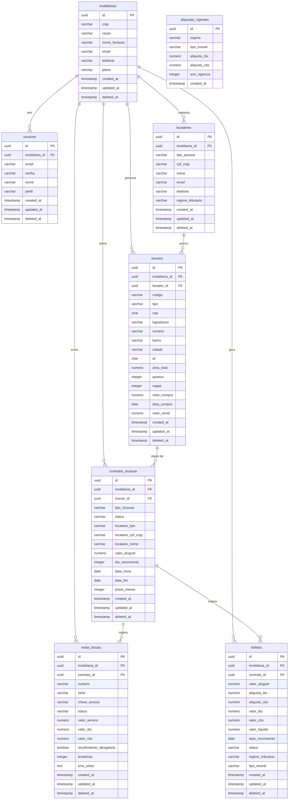

# Banco de Dados — ImobFiscal

> Documento de estudo para defesa de banca — PI 2 · FATEC DSM 2026-2.
> Explica o banco real do sistema: conceitos, estrutura, decisões de projeto.

---

## 1. O que é um banco de dados relacional?

Pense em um grande **armário de fichários**. Cada gaveta guarda um tipo de documento: uma gaveta para contratos, outra para proprietários, outra para imóveis. Dentro de cada gaveta há fichas padronizadas, todas com os mesmos campos.

No mundo técnico:

| Analogia | Termo técnico |
|---|---|
| Armário inteiro | Banco de dados |
| Gaveta | **Tabela** |
| Ficha dentro da gaveta | **Registro** (ou linha, ou tupla) |
| Campo da ficha (ex: "Nome") | **Coluna** (ou atributo) |
| Tipo de preenchimento do campo | **Tipo de dado** (`VARCHAR`, `INTEGER`, `DATE`…) |

O banco do ImobFiscal usa o **PostgreSQL**, um SGBD (Sistema Gerenciador de Banco de Dados) relacional e open source. "Relacional" quer dizer que as tabelas se relacionam entre si por meio de chaves — como fichas que têm um número de referência apontando para outra gaveta.

---

## 2. Conceitos fundamentais

### 2.1 Chave Primária (PK — Primary Key)

É o **identificador único** de cada registro. Nenhuma ficha em uma gaveta pode ter o mesmo número de PK. No ImobFiscal todas as PKs são **UUID** (ver seção 2.5).

```sql
-- Exemplo real de schema.sql
id UUID DEFAULT gen_random_uuid() PRIMARY KEY
```

### 2.2 Chave Estrangeira (FK — Foreign Key)

É uma coluna que **aponta para a PK de outra tabela**. Garante que você não cadastre um imóvel cujo locador não existe. O banco recusa o registro se a referência for inválida — isso chama **integridade referencial**.

```sql
-- Em imoveis: locador_id aponta para locadores.id
locador_id UUID NOT NULL REFERENCES locadores(id)
```

Se você tentar inserir um imóvel com um `locador_id` que não existe em `locadores`, o PostgreSQL retorna erro. Isso é o banco fazendo o trabalho de validação por você.

### 2.3 Constraints (restrições)

Regras que o banco aplica automaticamente em toda operação de INSERT ou UPDATE.

| Constraint | O que faz | Exemplo no projeto |
|---|---|---|
| `NOT NULL` | Campo obrigatório — não aceita vazio | `cnpj VARCHAR(14) NOT NULL` |
| `UNIQUE` | Valor não pode se repetir na tabela | `cnpj UNIQUE` (dois CNPJs iguais = erro) |
| `CHECK` | Valida um conjunto de valores permitidos | `plano CHECK (plano IN ('BASICO', 'PROFISSIONAL', 'ENTERPRISE'))` |
| `REFERENCES` (FK) | Garante integridade referencial | `imobiliaria_id REFERENCES imobiliarias(id)` |
| `DEFAULT` | Valor padrão quando não informado | `status DEFAULT 'RASCUNHO'` |

### 2.4 Índice

Um índice é uma **lista ordenada** que o banco mantém nos bastidores para encontrar registros sem precisar varrer a tabela inteira. É como o índice remissivo de um livro — você vai direto à página sem ler tudo.

As PKs sempre têm índice automático. No ImobFiscal, a tabela `boletos` tem 4 índices criados explicitamente:

```sql
-- V2__motor_fiscal.sql
CREATE INDEX idx_boletos_imobiliaria_id ON boletos(imobiliaria_id);
CREATE INDEX idx_boletos_contrato_id    ON boletos(contrato_id);
CREATE INDEX idx_boletos_status         ON boletos(status);
CREATE INDEX idx_boletos_data_vencimento ON boletos(data_vencimento);
```

As FKs das demais tabelas **não** têm índice explícito — uma limitação conhecida do projeto (ver seção 10).

### 2.5 Por que UUID em vez de número sequencial?

A maioria dos tutoriais usa `id SERIAL` (1, 2, 3…). O ImobFiscal usa `UUID` (ex: `550e8400-e29b-41d4-a716-446655440000`).

**Motivo:** o sistema atende várias imobiliárias (multi-tenancy). Com IDs sequenciais, a imobiliária A teria `id=1`, a B teria `id=2`, e alguém poderia tentar adivinhar IDs de outra empresa na URL da API. Com UUID gerado aleatoriamente isso é computacionalmente inviável.

A função `gen_random_uuid()` é fornecida pela extensão `pgcrypto`:

```sql
-- Primeira linha executada em schema.sql
CREATE EXTENSION IF NOT EXISTS pgcrypto;
```

### 2.6 Normalização (conceito resumido)

Normalização é o processo de organizar o banco para **eliminar redundância e inconsistência**. As formas normais mais cobradas em banca:

- **1FN:** cada coluna guarda um único valor atômico (sem listas, sem campos compostos).
- **2FN:** todo atributo depende da chave inteira, não de parte dela.
- **3FN:** nenhum atributo depende de outro atributo que não seja a PK (sem dependência transitiva).

No ImobFiscal, o endereço do imóvel é separado em colunas (`cep`, `logradouro`, `numero`, `bairro`, `cidade`, `uf`) — isso atende a 1FN. O nome do locatário fica em `contratos_locacao` (desnormalizado intencionalmente para preservar histórico fiscal — uma decisão justificada, não um erro).

---

## 3. Visão geral: as 8 tabelas

| # | Tabela | O que guarda | Criada em |
|---|---|---|---|
| 1 | `imobiliarias` | Cada empresa cliente do sistema (tenant raiz) | `schema.sql` |
| 2 | `usuarios` | Funcionários de cada imobiliária | `schema.sql` |
| 3 | `locadores` | Proprietários de imóveis (PF ou PJ) | `schema.sql` |
| 4 | `imoveis` | Imóveis gerenciados | `schema.sql` |
| 5 | `contratos_locacao` | Contratos entre locador e locatário | `schema.sql` |
| 6 | `notas_fiscais` | NF-e emitida por competência de contrato | `schema.sql` |
| 7 | `aliquotas_vigentes` | Tabela de alíquotas IBS/CBS por ano | `V2__motor_fiscal.sql` |
| 8 | `boletos` | Boletos de aluguel com detalhamento fiscal | `V2__motor_fiscal.sql` |

---

## 4. Diagrama ER (Entidade-Relacionamento)

O diagrama abaixo foi gerado a partir do schema real. As cardinalidades `||--o{` significam "um para muitos" (1:N).



**Nota:** `aliquotas_vigentes` não tem FK para nenhuma tabela — é uma tabela de parâmetro consultada pelo Motor Tributário do backend. A ligação é feita por código, não por constraint.

---

## 5. Cada tabela em detalhe

### 5.1 `imobiliarias` — o tenant raiz

Toda empresa que usa o sistema é uma "imobiliária" nesta tabela. É a **raiz do multi-tenancy**: quase todas as outras tabelas apontam para ela.

| Coluna | Tipo | Constraint | Descrição |
|---|---|---|---|
| `id` | `UUID` | PK, DEFAULT `gen_random_uuid()` | Identificador único |
| `cnpj` | `VARCHAR(14)` | NOT NULL, UNIQUE | CNPJ sem formatação |
| `razao` | `VARCHAR(255)` | NOT NULL | Razão social |
| `nome_fantasia` | `VARCHAR(255)` | — | Nome de exibição |
| `email` | `VARCHAR(255)` | NOT NULL | Email de contato |
| `telefone` | `VARCHAR(255)` | — | Telefone |
| `plano` | `VARCHAR(20)` | NOT NULL, CHECK | `BASICO`, `PROFISSIONAL` ou `ENTERPRISE` |
| `created_at` | `TIMESTAMP` | NOT NULL, DEFAULT NOW() | Data de criação |
| `updated_at` | `TIMESTAMP` | NOT NULL, DEFAULT NOW() | Última atualização |
| `deleted_at` | `TIMESTAMP` | — | Soft delete (nulo = ativo) |

Não possui FK — é a tabela de topo da hierarquia.

### 5.2 `usuarios` — funcionários da imobiliária

Cada usuário pertence a exatamente uma imobiliária. A senha é armazenada como **hash BCrypt** — o banco nunca vê a senha em texto puro.

| Coluna | Tipo | Constraint | Descrição |
|---|---|---|---|
| `id` | `UUID` | PK | — |
| `imobiliaria_id` | `UUID` | NOT NULL, FK→`imobiliarias` | Dono do usuário |
| `email` | `VARCHAR(255)` | NOT NULL, UNIQUE | Login do sistema |
| `senha` | `VARCHAR(255)` | NOT NULL | Hash BCrypt |
| `nome` | `VARCHAR(255)` | NOT NULL | Nome de exibição |
| `perfil` | `VARCHAR(20)` | NOT NULL, CHECK | `ADMIN`, `GERENTE`, `OPERADOR`, `FINANCEIRO` ou `READONLY` |
| `created_at` / `updated_at` / `deleted_at` | `TIMESTAMP` | — | Auditoria e soft delete |

### 5.3 `locadores` — proprietários de imóveis

Pessoa Física (PF) ou Jurídica (PJ) que possui imóveis gerenciados pela imobiliária. A coluna `regime_tributario` foi adicionada na **migração V2** para o cálculo de IBS/CBS.

| Coluna | Tipo | Constraint | Descrição |
|---|---|---|---|
| `id` | `UUID` | PK | — |
| `imobiliaria_id` | `UUID` | NOT NULL, FK→`imobiliarias` | Imobiliária gestora |
| `tipo_pessoa` | `VARCHAR(2)` | NOT NULL, CHECK | `PF` ou `PJ` |
| `cpf_cnpj` | `VARCHAR(14)` | NOT NULL | CPF (11 dígitos) ou CNPJ (14 dígitos) |
| `nome` | `VARCHAR(255)` | NOT NULL | Nome completo ou razão social |
| `email` | `VARCHAR(255)` | — | Contato |
| `telefone` | `VARCHAR(255)` | — | Contato |
| `regime_tributario` | `VARCHAR(30)` | CHECK | `PF`, `SIMPLES_NACIONAL`, `LUCRO_PRESUMIDO` ou `LUCRO_REAL` — adicionado em V2 |
| `created_at` / `updated_at` / `deleted_at` | `TIMESTAMP` | — | Auditoria e soft delete |

### 5.4 `imoveis` — os imóveis gerenciados

Cada imóvel pertence a um locador e está sob gestão de uma imobiliária. O endereço é decomposto em colunas separadas (1FN). `valor_venal` foi adicionado em V2.

| Coluna | Tipo | Constraint | Descrição |
|---|---|---|---|
| `id` | `UUID` | PK | — |
| `imobiliaria_id` | `UUID` | NOT NULL, FK→`imobiliarias` | — |
| `locador_id` | `UUID` | NOT NULL, FK→`locadores` | Proprietário |
| `codigo` | `VARCHAR(255)` | NOT NULL | Código interno (ex: `IDA-001`) |
| `tipo` | `VARCHAR(20)` | NOT NULL, CHECK | `RESIDENCIAL`, `COMERCIAL`, `RURAL` ou `MISTO` |
| `cep` | `CHAR(8)` | NOT NULL | 8 dígitos sem hífen |
| `logradouro`, `numero`, `complemento`, `bairro`, `cidade` | `VARCHAR(255)` | — | Endereço decomposto |
| `uf` | `CHAR(2)` | NOT NULL | Sigla do estado |
| `area_total` | `NUMERIC(12,2)` | — | m² |
| `quartos`, `vagas` | `INTEGER` | — | Dados físicos |
| `valor_compra` | `NUMERIC(15,2)` | — | Custo de aquisição (GCAP) |
| `data_compra` | `DATE` | — | Data de aquisição |
| `valor_venal` | `NUMERIC(15,2)` | — | Valor de referência municipal — adicionado em V2 |
| `created_at` / `updated_at` / `deleted_at` | `TIMESTAMP` | — | Auditoria e soft delete |

### 5.5 `contratos_locacao` — o vínculo entre imóvel e locatário

O contrato não tem FK direta para `locadores` — o locador é obtido indiretamente via `imovel_id → imoveis.locador_id`. Os dados do locatário são **desnormalizados** (guardados diretamente no contrato) para preservar o histórico fiscal mesmo se o cadastro for alterado.

| Coluna | Tipo | Constraint | Descrição |
|---|---|---|---|
| `id` | `UUID` | PK | — |
| `imobiliaria_id` | `UUID` | NOT NULL, FK→`imobiliarias` | — |
| `imovel_id` | `UUID` | NOT NULL, FK→`imoveis` | Imóvel locado |
| `tipo_locacao` | `VARCHAR(20)` | NOT NULL, CHECK | `RESIDENCIAL_LONGA`, `COMERCIAL`, `SHORT_STAY` ou `RURAL` |
| `status` | `VARCHAR(20)` | NOT NULL, CHECK, DEFAULT `RASCUNHO` | `RASCUNHO`, `ATIVO`, `RESCINDIDO` ou `ENCERRADO` |
| `locatario_tipo` | `VARCHAR(2)` | NOT NULL, CHECK | `PF` ou `PJ` |
| `locatario_cpf_cnpj` | `VARCHAR(14)` | NOT NULL | — |
| `locatario_nome` | `VARCHAR(255)` | NOT NULL | Desnormalizado para histórico |
| `valor_aluguel` | `NUMERIC(15,2)` | NOT NULL | Valor mensal |
| `dia_vencimento` | `INTEGER` | NOT NULL, CHECK 1..31 | Dia do mês do vencimento |
| `data_inicio` | `DATE` | NOT NULL | — |
| `data_fim` | `DATE` | — | Nulo = prazo indeterminado |
| `prazo_meses` | `INTEGER` | — | — |
| `created_at` / `updated_at` / `deleted_at` | `TIMESTAMP` | — | Auditoria e soft delete |

### 5.6 `notas_fiscais` — documento fiscal da competência

Gerada pelo backend para cada mês de um contrato ativo. Os valores `valor_ibs` e `valor_cbs` usam `NUMERIC(15,4)` — quatro casas decimais para não perder precisão em alíquotas pequenas.

| Coluna | Tipo | Constraint | Descrição |
|---|---|---|---|
| `id` | `UUID` | PK | — |
| `imobiliaria_id` | `UUID` | NOT NULL, FK→`imobiliarias` | — |
| `contrato_id` | `UUID` | NOT NULL, FK→`contratos_locacao` | Contrato de origem |
| `numero`, `serie` | `VARCHAR(255)` | — | Numeração SEFAZ |
| `chave_acesso` | `VARCHAR(44)` | UNIQUE | Chave de 44 dígitos da NF-e |
| `status` | `VARCHAR(20)` | NOT NULL, CHECK, DEFAULT `AGUARDANDO` | `AGUARDANDO`, `PROCESSANDO`, `AUTORIZADA`, `REJEITADA` ou `CANCELADA` |
| `valor_servico` | `NUMERIC(15,2)` | NOT NULL | Valor do aluguel |
| `valor_ibs` | `NUMERIC(15,4)` | NOT NULL, DEFAULT 0 | IBS calculado |
| `valor_cbs` | `NUMERIC(15,4)` | NOT NULL, DEFAULT 0 | CBS calculada |
| `recolhimento_obrigatorio` | `BOOLEAN` | NOT NULL, DEFAULT FALSE | False em 2026 (fase informativa) |
| `tentativas` | `INTEGER` | NOT NULL, DEFAULT 0 | Retry SEFAZ (máx 5) |
| `erro_sefaz` | `TEXT` | — | Mensagem de erro retornada pela SEFAZ |
| `created_at` / `updated_at` / `deleted_at` | `TIMESTAMP` | — | Auditoria e soft delete |

### 5.7 `aliquotas_vigentes` — tabela de parâmetro fiscal

Tabela de **referência imutável**: guarda as alíquotas IBS e CBS para cada combinação de regime tributário, tipo de imóvel e ano. Não tem `updated_at` nem `deleted_at` — os dados nunca são alterados, apenas acrescentados para novos anos.

| Coluna | Tipo | Constraint | Descrição |
|---|---|---|---|
| `id` | `UUID` | PK | — |
| `regime` | `VARCHAR(30)` | NOT NULL, CHECK | `PF`, `SIMPLES_NACIONAL`, `LUCRO_PRESUMIDO` ou `LUCRO_REAL` |
| `tipo_imovel` | `VARCHAR(20)` | NOT NULL, CHECK | `RESIDENCIAL`, `COMERCIAL`, `RURAL` ou `MISTO` |
| `aliquota_ibs` | `NUMERIC(6,4)` | NOT NULL | Ex: `0.0145` = 1,45% |
| `aliquota_cbs` | `NUMERIC(6,4)` | NOT NULL | Ex: `0.0076` = 0,76% |
| `ano_vigencia` | `INTEGER` | NOT NULL | Ano fiscal |
| `created_at` | `TIMESTAMP` | NOT NULL | Apenas criação |
| — | — | UNIQUE(`regime`, `tipo_imovel`, `ano_vigencia`) | Impede duplicata por combinação/ano |

### 5.8 `boletos` — boleto de aluguel com detalhamento fiscal

Gerado pelo Motor Tributário. Registra as alíquotas **no momento da geração** — mesmo que as alíquotas mudem no ano seguinte, o boleto já emitido fica imutável. Tem os 4 índices explícitos mais completos do banco.

| Coluna | Tipo | Constraint | Descrição |
|---|---|---|---|
| `id` | `UUID` | PK | — |
| `imobiliaria_id` | `UUID` | NOT NULL, FK→`imobiliarias` | — |
| `contrato_id` | `UUID` | NOT NULL, FK→`contratos_locacao` | Contrato de origem |
| `valor_aluguel` | `NUMERIC(15,2)` | NOT NULL | Valor base |
| `aliquota_ibs`, `aliquota_cbs` | `NUMERIC(6,4)` | NOT NULL | Alíquotas congeladas no momento da emissão |
| `valor_ibs`, `valor_cbs` | `NUMERIC(15,4)` | NOT NULL | Valores calculados |
| `valor_liquido` | `NUMERIC(15,2)` | NOT NULL | Aluguel − IBS − CBS |
| `data_vencimento` | `DATE` | NOT NULL | — |
| `status` | `VARCHAR(20)` | NOT NULL, CHECK, DEFAULT `GERADO` | `GERADO`, `PAGO`, `VENCIDO` ou `CANCELADO` |
| `regime_tributario`, `tipo_imovel` | `VARCHAR` | NOT NULL | Contexto fiscal registrado na geração |
| `created_at` / `updated_at` / `deleted_at` | `TIMESTAMP` | — | Auditoria e soft delete |

---

## 6. Os relacionamentos explicados

Todos os relacionamentos do ImobFiscal são **1:N** (um para muitos). Não existe tabela de junção — não há relacionamento N:N no modelo atual.

### Hierarquia principal

```
imobiliarias (1)
    ├── (N) usuarios          — uma empresa tem muitos usuários
    ├── (N) locadores         — uma empresa cadastra muitos proprietários
    ├── (N) imoveis           — uma empresa gerencia muitos imóveis
    ├── (N) contratos_locacao — uma empresa opera muitos contratos
    ├── (N) notas_fiscais     — uma empresa emite muitas NFs
    └── (N) boletos           — uma empresa gera muitos boletos
```

### Cadeia de negócio

```
locadores (1) ──── (N) imoveis
                         │
                    (1)  │
                         ▼
contratos_locacao (N) ──── imoveis (1)
        │
   (1)  │
        ├── (N) notas_fiscais
        └── (N) boletos
```

**Ponto importante para a banca:** `contratos_locacao` não tem FK direta para `locadores`. O caminho é `contrato → imovel → locador`. Isso foi uma decisão de modelo: o contrato é com o imóvel, não diretamente com o proprietário. Se o imóvel mudar de dono, os contratos históricos continuam intactos.

**Cardinalidade 1:N na prática:**

- Um locador pode ter **muitos** imóveis, mas cada imóvel tem **um** locador: `locadores ||--o{ imoveis`.
- Um imóvel pode ter **muitos** contratos ao longo do tempo (locatários diferentes), mas cada contrato aponta para **um** imóvel.
- Um contrato gera **muitas** notas fiscais (uma por mês de competência) e **muitos** boletos.

---

## 7. Padrões de projeto do banco

### 7.1 Soft delete — exclusão lógica

Todas as tabelas de negócio têm a coluna `deleted_at TIMESTAMP`. Quando um registro é "excluído" no sistema, o backend **não apaga a linha** — apenas preenche `deleted_at` com a data/hora atual.

```sql
-- Exclusão lógica: atualiza deleted_at
UPDATE imoveis SET deleted_at = NOW() WHERE id = '...';

-- Consulta normal: filtra apenas ativos
SELECT * FROM imoveis WHERE deleted_at IS NULL;
```

**Por que fazer isso?** Legislação fiscal exige que documentos (contratos, notas fiscais) sejam preservados por **5 anos**. Apagar fisicamente violaria essa obrigação. O soft delete garante o histórico completo para auditoria.

A tabela `aliquotas_vigentes` não tem `deleted_at` porque é uma tabela de parâmetro — seus registros são imutáveis por design.

### 7.2 created_at e updated_at — auditoria temporal

Toda tabela de negócio registra automaticamente quando o registro foi criado e quando foi modificado pela última vez. O banco popula o valor inicial via `DEFAULT NOW()`, e o backend é responsável por atualizar `updated_at` a cada mudança.

### 7.3 Multi-tenancy por coluna — shared schema

O sistema atende **várias imobiliárias** usando um único banco de dados e as mesmas tabelas. A estratégia escolhida é **shared schema**: cada linha carrega a coluna `imobiliaria_id NOT NULL` indicando a qual empresa pertence.

Quando o backend faz uma consulta, sempre inclui o filtro do tenant:

```sql
-- A aplicação sempre filtra pelo tenant autenticado
SELECT * FROM imoveis
WHERE imobiliaria_id = '...' AND deleted_at IS NULL;
```

O modelo **não usa RLS** (Row Level Security do PostgreSQL). A separação entre empresas depende inteiramente da aplicação aplicar o filtro correto. Isso é uma limitação de segurança conhecida: se o código tiver um bug e esquecer o filtro `imobiliaria_id`, um usuário de uma empresa poderia ver dados de outra.

### 7.4 Enums via VARCHAR + CHECK — não ENUM nativo

O PostgreSQL tem um tipo `ENUM` nativo. O ImobFiscal optou por `VARCHAR` com `CHECK`:

```sql
-- Padrão usado em todo o projeto
plano VARCHAR(20) NOT NULL CHECK (plano IN ('BASICO', 'PROFISSIONAL', 'ENTERPRISE'))
```

**Motivo:** ENUMs nativos do PostgreSQL são difíceis de alterar (adicionar um novo valor exige `ALTER TYPE`). Com `VARCHAR + CHECK`, basta alterar a constraint em uma nova migration — operação mais simples e compatível com qualquer ferramenta de versionamento de schema.

### 7.5 Precisão numérica

| Caso | Tipo | Explicação |
|---|---|---|
| Valores monetários (aluguel, valor de compra) | `NUMERIC(15,2)` | 2 casas decimais: centavos |
| Valores IBS/CBS calculados | `NUMERIC(15,4)` | 4 casas: evita erro de arredondamento em alíquotas pequenas |
| Alíquotas em si | `NUMERIC(6,4)` | Ex: `0.0145` = 1,45% com precisão total |

---

## 8. Migrations e seed

### 8.1 O que é uma migration?

Uma **migration** é um script SQL versionado que representa uma mudança no schema. O nome do arquivo já indica a ordem de execução:

| Arquivo | Versão | O que faz |
|---|---|---|
| `schema.sql` (V1) | Versão inicial | Cria as 6 tabelas originais |
| `V2__motor_fiscal.sql` | Versão 2 | Adiciona colunas, cria `aliquotas_vigentes` e `boletos` |

O schema é criado executando os scripts na pasta `database/` **manualmente**, na ordem:
`schema.sql` → `V2__motor_fiscal.sql` → `seed.sql`. Não há Hibernate, JPA nem criação
automática por ORM. O projeto **não usa Flyway**.

Os arquivos seguem a convenção de nome versionada (`V2__`) como organização e servem como
**documentação do schema** e ponto de partida para qualquer instalação nova (por exemplo,
aplicar no banco do Railway).

**Regra de ouro:** nunca edite um script já aplicado em produção.
Para corrigir uma estrutura, crie um novo script (`V3__corrigir_xyz.sql`) e aplique
manualmente — isso mantém o histórico rastreável. Para um produto de produção real, o
recomendado seria adotar Flyway ou Liquibase, garantindo que o schema só evolua por
migrações revisadas e versionadas.

### 8.2 O que é seed?

O arquivo `seed.sql` insere **dados fictícios de demonstração** para que o sistema funcione imediatamente após a instalação. Não é uma migration — é executado manualmente apenas em desenvolvimento ou no ambiente de demonstração.

O que o seed cria:

| O que | Detalhes |
|---|---|
| 1 imobiliária | UUID fixo `11111111-…`, CNPJ `12345678000195`, plano `PROFISSIONAL`, nome "ImobFiscal Demo" |
| 1 usuário | `admin@imobfiscal.com.br`, senha `admin123` (hash BCrypt), perfil `ADMIN` |
| 2 locadores | Carlos Eduardo Pereira (PF) e Imóveis Centro Ltda (PJ) |
| 3 imóveis | IDA-001 residencial em Indaiatuba/SP, CAM-002 residencial em Campinas/SP, SAO-003 comercial na Av. Paulista/SP |
| 1 contrato | `RESIDENCIAL_LONGA`, locatário Roberto Alves, aluguel R$ 1.800,00, vencimento dia 5, início 2026-01-01, 30 meses |
| 1 nota fiscal | `AUTORIZADA`, valor R$ 1.800,00, IBS R$ 1,80 (0,1%), CBS R$ 16,20 (0,9%), `recolhimento_obrigatorio = false` |

O UUID da imobiliária demo é **fixo** (`11111111-1111-1111-1111-111111111111`) para que o frontend possa referenciar o tenant de demonstração sem configuração adicional.

---

## 9. A tabela `aliquotas_vigentes` e o Motor Tributário

### Por que as alíquotas ficam no banco?

A **Reforma Tributária** (LC 214/2025) introduziu o IBS (Imposto sobre Bens e Serviços) e a CBS (Contribuição sobre Bens e Serviços) como substitutos dos tributos anteriores. Durante a transição de 2026 a 2033, as alíquotas **sobem gradualmente a cada ano**.

Se as alíquotas fossem hardcoded no código-fonte, seria necessário alterar e redeployar o sistema a cada virada de ano. Com a tabela `aliquotas_vigentes`, basta inserir as linhas do novo ano:

```sql
-- Para adicionar 2027: só inserir novas linhas
INSERT INTO aliquotas_vigentes (regime, tipo_imovel, aliquota_ibs, aliquota_cbs, ano_vigencia)
VALUES ('PF', 'RESIDENCIAL', 0.0200, 0.0100, 2027);
-- ... demais combinações
```

### Como o Motor Tributário usa essa tabela

O `MotorTributario` no backend (via DAO com JdbcTemplate) faz a seguinte consulta quando gera um boleto:

```sql
SELECT aliquota_ibs, aliquota_cbs
FROM aliquotas_vigentes
WHERE regime     = :regime_do_locador
  AND tipo_imovel = :tipo_do_imovel
  AND ano_vigencia = EXTRACT(YEAR FROM CURRENT_DATE);
```

A constraint `UNIQUE(regime, tipo_imovel, ano_vigencia)` garante que essa consulta retorna **exatamente uma linha** — sem ambiguidade.

### Estrutura das 16 linhas de 2026

A tabela foi populada com 4 regimes × 4 tipos de imóvel = 16 combinações:

| Regime | Tipo | IBS | CBS |
|---|---|---|---|
| PF | RESIDENCIAL | 1,45% | 0,76% |
| PF | COMERCIAL | 2,90% | 1,53% |
| SIMPLES_NACIONAL | RESIDENCIAL | 1,45% | 0,76% |
| LUCRO_PRESUMIDO | COMERCIAL | 4,00% | 2,00% |
| LUCRO_REAL | COMERCIAL | 5,00% | 2,50% |
| … | … | … | … |

> Valores ilustrativos para fins didáticos do PI, aproximados com base na LC 214/2025.

---

## 10. Limitações e observações honestas

A banca pode perguntar o que poderia ser melhorado. Respostas corretas:

| Limitação | Detalhe |
|---|---|
| **FKs sem índice explícito** | `imoveis.locador_id`, `contratos_locacao.imovel_id`, `notas_fiscais.contrato_id` não têm índice. Consultas que filtram por essas colunas fazem full scan. `boletos` é a única tabela com índices explícitos nas FKs. |
| **Sem RLS** | O isolamento entre imobiliárias depende 100% da aplicação incluir o filtro `imobiliaria_id`. O PostgreSQL não aplica nenhuma regra de segurança por linha — um bug na camada de serviço pode vazar dados entre tenants. |
| **README com DER desatualizado** | O arquivo `database/README.md` contém um diagrama Mermaid desatualizado: usa `bigint id` (o schema real usa `UUID`), não inclui `imobiliarias`, `aliquotas_vigentes` nem `boletos`, e mostra uma FK inexistente entre `contratos_locacao` e `locadores`. O DER fiel é o da seção 4 deste documento. |
| **Sem particionamento** | A tabela `notas_fiscais` e `boletos` podem crescer muito ao longo dos anos. Não há particionamento por data. Seria necessário avaliar se o volume justifica. |
| **Sem `updated_at` em `aliquotas_vigentes`** | Intencional — é uma tabela de parâmetro imutável. Mas se uma alíquota for inserida com erro, a correção exige uma nova linha para o mesmo ano (não é possível atualizar a existente sem violar a semântica de imutabilidade). |

---

## 11. Mini-glossário

| Termo | Definição resumida |
|---|---|
| **SGBD** | Software que gerencia o banco (PostgreSQL, MySQL, Oracle…) |
| **Tabela** | Estrutura que organiza dados em linhas e colunas |
| **Registro** | Uma linha de uma tabela |
| **Coluna** | Um campo de uma tabela (ex: `nome`, `email`) |
| **PK (Primary Key)** | Coluna que identifica unicamente cada registro |
| **FK (Foreign Key)** | Coluna que referencia a PK de outra tabela |
| **Constraint** | Regra automática do banco (`NOT NULL`, `UNIQUE`, `CHECK`, `REFERENCES`) |
| **Índice** | Estrutura auxiliar que acelera buscas em uma coluna |
| **UUID** | Identificador universal único gerado aleatoriamente (ex: `550e8400-…`) |
| **Normalização** | Processo de organizar o banco para eliminar redundância |
| **Cardinalidade 1:N** | Um registro de A se relaciona com vários de B; cada B pertence a um A |
| **Soft delete** | Marcar registro como excluído (`deleted_at`) sem apagar fisicamente |
| **Multi-tenancy** | Múltiplos clientes usando o mesmo banco, separados por uma coluna |
| **Migration** | Script SQL versionado que evolui o schema de forma controlada |
| **Seed** | Script que insere dados de demonstração para facilitar testes |
| **IBS** | Imposto sobre Bens e Serviços — tributo estadual/municipal da Reforma Tributária |
| **CBS** | Contribuição sobre Bens e Serviços — tributo federal da Reforma Tributária |
| **RLS** | Row Level Security — recurso do PostgreSQL que aplica filtros automáticos por linha |
| **JdbcTemplate** | Classe do Spring que executa SQL escrito à mão de forma segura (parâmetros tipados, sem concatenação); é como o backend acessa o banco neste projeto |
| **DAO** | Data Access Object — classe que concentra o SQL de um recurso e mapeia as linhas retornadas para POJOs |
| **BCrypt** | Algoritmo de hash para senhas — armazena senha de forma irreversível |
| **pgcrypto** | Extensão do PostgreSQL que fornece `gen_random_uuid()` |

---

*Verificado contra: `database/schema.sql`, `database/V2__motor_fiscal.sql`, `database/seed.sql` — backend MVC + SQL puro (sem Hibernate/JPA) — PI 2 · FATEC DSM 2026-2. Última atualização: 2026-06-02.*
