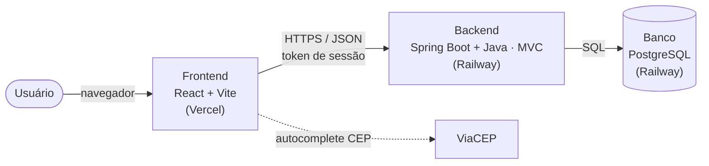

# Guia de Estudo — ImobFiscal (preparação para a banca)

Esta pasta reúne explicações **didáticas** de como cada parte do sistema foi
construída, escritas para serem entendidas por quem não programou o projeto e
para te preparar para defender o trabalho diante da banca avaliadora.

> Para os **documentos formais de Engenharia de Software** (requisitos, casos de
> uso, diagramas, arquitetura, testes etc.), veja a pasta `docs/` um nível acima.
> O índice desses documentos está no fim desta página.

---

## Como usar este material

1. **Leia na ordem.** Comece pelo frontend (o que o usuário vê), depois o
   backend (a lógica) e por fim o banco (onde os dados moram).
2. **Rode o sistema antes da apresentação** seguindo o `COMO-RODAR.md` na raiz
   do projeto — ver a tela funcionando fixa o conteúdo.
3. **Decore o pitch** e revise as perguntas prováveis no guia da banca.
4. **Aponte limitações com honestidade.** Cada arquivo tem uma seção de
   limitações — a banca valoriza quem conhece os pontos fracos do próprio
   projeto e sabe o que faria para melhorá-los.

---

## Os quatro arquivos de estudo

| # | Arquivo | O que cobre | Quando estudar |
| --- | --- | --- | --- |
| 1 | [01-frontend.md](01-frontend.md) | React + Vite: SPA, componentes, hooks, rotas, autenticação no cliente, telas | Para explicar "o que o usuário vê e como a tela fala com o servidor" |
| 2 | [02-backend.md](02-backend.md) | Spring Boot + Java: API REST, MVC, SQL puro (JdbcTemplate), **Motor Tributário (IBS/CBS)**, testes | Para explicar "como o sistema pensa e calcula o imposto" |
| 3 | [03-banco-de-dados.md](03-banco-de-dados.md) | PostgreSQL: tabelas, chaves, DER, soft delete, multi-tenancy, migrations, seed | Para explicar "onde e como os dados ficam guardados" |
| 4 | [04-guia-banca.md](04-guia-banca.md) | Perguntas e respostas prováveis, pitch de 60s, perguntas-armadilha, glossário | Revisão final na véspera |

---

## Mapa rápido do sistema (visão de 30 segundos)

- **Frontend** = a vitrine. Mostra as telas e envia pedidos ao backend.
- **Backend** = o escritório. Recebe os pedidos, aplica as regras (incluindo o
  cálculo fiscal) e conversa com o banco.
- **Banco** = o arquivo. Guarda imóveis, locadores, contratos, boletos e as
  alíquotas vigentes.

---

## Os números que a banca costuma pedir (do `seed.sql`)

- **1** imobiliária demo · **1** usuário admin (`admin@imobfiscal.com.br`)
- **2** locadores (1 pessoa física, 1 pessoa jurídica) · **3** imóveis · **1**
  contrato ativo · **1** nota fiscal autorizada
- Exemplo de cálculo: aluguel **R$ 1.800,00**, IBS **0,1%** (R$ 1,80) e CBS
  **0,9%** (R$ 16,20), com `recolhimento_obrigatorio = false` (fase de testes de
  2026).

---

## Índice dos documentos de Engenharia de Software (`../`)

| Documento | Artefato |
| --- | --- |
| [00-plano-pi2.md](../00-plano-pi2.md) | Plano de projeto e cronograma |
| [01-escopo.md](../01-escopo.md) | Escopo / visão do produto |
| [02-requisitos.md](../02-requisitos.md) | Requisitos (RF, RNF, RN) |
| [03-casos-de-uso.md](../03-casos-de-uso.md) | Casos de uso UML (UC01–UC10) |
| [03-diagrama-sequencia.md](../03-diagrama-sequencia.md) | Diagrama de sequência |
| [04-diagrama-classes.md](../04-diagrama-classes.md) | Diagrama de classes |
| [05-dicionario-dados.md](../05-dicionario-dados.md) | Dicionário de dados |
| [06-plano-testes.md](../06-plano-testes.md) | Plano e casos de teste |
| [07-consideracoes-finais.md](../07-consideracoes-finais.md) | Encerramento |
| [08-documento-arquitetura.md](../08-documento-arquitetura.md) | Arquitetura (C4, ADRs, implantação) |
| [09-der.md](../09-der.md) | Diagrama Entidade-Relacionamento |
| [10-matriz-rastreabilidade.md](../10-matriz-rastreabilidade.md) | Matriz de rastreabilidade |
| [11-diagrama-atividades.md](../11-diagrama-atividades.md) | Diagramas de atividades |
| [12-processo-desenvolvimento.md](../12-processo-desenvolvimento.md) | Modelo de processo |

---

_Última atualização: 2026-06-02. Conteúdo verificado contra o código real em
`frontend/`, `backend/` e `database/`._
